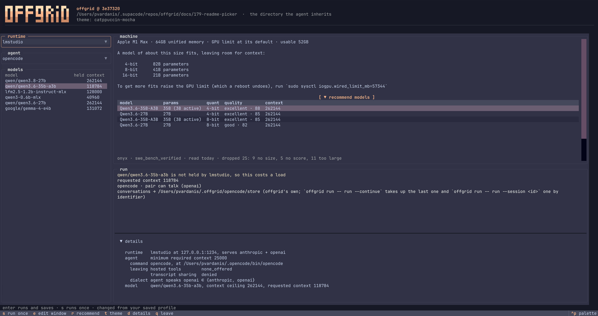

<div align="center">

<h1>offgrid</h1>

Run a coding agent against a local model, tuned to the machine it runs on.

[](https://github.com/pvardanis/offgrid/actions/workflows/checks.yml)
[](https://www.python.org/downloads/)
[](#development)
[](#development)
[](https://github.com/astral-sh/ruff)
[](https://github.com/astral-sh/ty)
[](https://github.com/astral-sh/uv)
[](#requirements)

</div>



offgrid starts a coding **agent** against a model held in memory by a
**runtime** on this machine. It holds the model you asked for, sizes the
agent's context to the window the runtime is actually serving, and lets the
model go when the agent exits. No prompt, code or file leaves the machine.

Run `offgrid` with nothing after it and the whole of that happens on one screen —
the [TUI](#tui) above. The commands underneath it are the same steps for a
script.

## Contents

- [TUI](#tui)
- [Quick start](#quick-start)
- [Concepts](#concepts)
- [Why](#why)
- [Requirements](#requirements)
- [Install](#install)
- [Commands](#commands)
- [What a run does](#what-a-run-does)
- [Runtimes](#runtimes)
- [Agents](#agents)
- [The profile](#the-profile)
- [What offgrid does not do](#what-offgrid-does-not-do)
- [Measured on an M1 Max](#measured-on-an-m1-max)
- [Development](#development)

## TUI

The full-screen picker above is what bare `offgrid` opens. On it you see what
fits this machine, pair a runtime, an agent and a model, and start the run,
without touching the profile by hand. Where there is no terminal to draw on — a
script, a pipe — it prints the [command table](#commands) instead.

The keys match Claude Code's model picker, so the reflex carries over:

| Key | What it does |
|---|---|
| `enter` | Run the highlighted pairing, and save it as the profile |
| `s` | Run it once, saving nothing |
| `e` | Edit the model's context window |
| `r` | Show or hide the models a published list recommends for this machine |
| `t` | Cycle the theme |
| `d` | Show or hide the detail behind a run |
| `q` | Leave, changing nothing |

Only `enter` writes. Browsing the lists, editing a window, cycling the theme and
opening the recommendations all leave the profile alone until a run starts.

## Concepts

Five words carry the whole design, and the modules are named after them.

- **runtime** — the server that holds models in memory and answers requests.
  One adapter per runtime, in `runtimes/`.
- **agent** — the coding tool being launched. One adapter per agent, in
  `agents/`.
- **dialect** — the HTTP API shape a runtime serves and an agent expects,
  `anthropic` or `openai`. A runtime serves a set of them and an agent speaks
  one, and the two can be paired only when the agent's is among the runtime's.
  offgrid refuses the pair rather than translating between them.
- **held**, **resident** — a model the runtime currently has in memory. A held
  model answers immediately; anything else costs a load first.
- **profile** — what offgrid remembers between runs: one section per adapter,
  saying which runtime and agent to use and whatever each of them reads, plus
  which model to run.

## Why

Pointing an agent at a local server is a dozen environment variables, and
getting one wrong fails quietly rather than loudly.

- **Context.** A model's catalogue entry states its *ceiling* until it is
  loaded, and the window it is *served* at afterwards. Size the agent from the
  ceiling and it never compacts — the runtime truncates the prefix instead,
  which is the failure compacting exists to prevent.
- **Memory.** One machine, one pool. A model left loaded is memory nothing else
  can use, and a runtime's own tooling will happily report success having freed
  nothing.
- **Naming.** A runtime asked for a model it does not have may answer anyway,
  with whatever it does hold — so a typo runs the wrong model without saying so.
- **Search.** An agent's web search may execute on its vendor's servers. Against
  a local model there is nothing to run it, and what comes back is invented
  rather than an error.

offgrid does that plumbing, says what it did, and gets out of the way.

## Requirements

- macOS on Apple Silicon
- Python 3.13+
- A [supported runtime](#runtimes), with its local server running
- A [supported agent](#agents)
- A model downloaded in the runtime

## Install

offgrid is installed with [uv](https://github.com/astral-sh/uv), which is one
command if you do not have it:

```sh
curl -LsSf https://astral.sh/uv/install.sh | sh     # or: brew install uv
```

Then:

```sh
uv tool install git+https://github.com/pvardanis/offgrid
```

That puts `offgrid` on your `PATH`. `uv tool upgrade offgrid` later, `uv tool
uninstall offgrid` to remove it.

From a clone, for development:

```sh
git clone https://github.com/pvardanis/offgrid
cd offgrid
just install            # uv sync, and the checks on every commit
```

That puts the virtualenv at `.venv` in the clone, with offgrid and the dev
tools in it. `uv run <command>` uses it without activating anything, which is
what the recipes do. Activate it when you want the tools on your `PATH`
directly — for a shell session, or to point an editor at the interpreter:

```sh
source .venv/bin/activate    # .venv/bin/activate.fish for fish
offgrid --help               # and deactivate when done
```

The recipes need [just](https://github.com/casey/just):

```sh
brew install just                    # or: cargo install just
uvx --from rust-just just --list     # or run it without installing anything
```

Without it, `uv sync && uv run prek install` does the same thing — every recipe
is one line, so the file reads as a list of commands.

## Quick start

With a [runtime](#runtimes) running and a model downloaded, run offgrid:

```sh
offgrid
```

The [TUI](#tui) sizes the machine, shows what fits, lets you pick a model, and
starts the agent — everything on one screen. It also shows what other tools do
not: the window a model would be *served* at, before the run, and a warning that
swapping models costs a load and takes the held model's cached prefix with it.

For a script, or the steps one at a time, each is a command:

- `offgrid setup` — measure the machine and write a profile
- `offgrid recommend` — name the published models that fit
- `offgrid doctor` — say what a run would find, without paying for a load
- `offgrid run` — start the agent

[Commands](#commands) has what each prints and the flags it takes.

## Commands

| Command | What it does |
|---|---|
| `offgrid` | Opens the [TUI](#tui) at a terminal — the four commands below on one screen — or prints this table where there is no terminal to open on. |
| `offgrid setup [--host HOST]` | Measures this Mac, says what fits, writes the profile. Keeps whatever you edited into it by hand — unless the file no longer loads, which is set aside as `profile.yaml.rejected` and replaced. |
| `offgrid recommend` | Fetches a published coding table, keeps the models this machine can hold, prints them at each width they fit at, and says how the runtime the profile names has one downloaded into it. |
| `offgrid doctor` | Reports the runtime, the model it is holding, the most that model could be served at, what it is being served at, what the profile asks the next run for, whether the agent it names is on the `PATH`, the smallest window the agent starts in, the dialects the runtime serves, and the agent's own dialect. A runtime holding nothing is reported in the model's lines and exits `1`; every other line is read without one. |
| `offgrid run [-m MODEL] [--context-window N] [-- ARGS]` | Starts the agent. Loads `MODEL` when it is not already held, otherwise uses what is. Holds it at `N` where one is asked for. |

The command line beats the `model:` section of the profile, which beats
whatever the runtime already holds and whatever it already serves it at. Each
key is beaten on its own, so `-m` alone keeps the window written in the file.

**`recommend` is the only command that reaches the network.** It is a `GET` of
one public page, `https://onyx.app/best-llm-for-coding`, carrying an `RSC: 1`
header alongside the HTTP client's own defaults — no model name, no memory
figure, nothing about this machine or the work being done on it, and no
cookie, since nothing is kept between runs. What the other end can see is what any
web request shows it: an IP address, a time, and the page asked for. Nothing is
downloaded, and nothing is written.

**Exit codes**, so it composes in scripts:

| Code | Meaning |
|---|---|
| *n* | whatever the agent exited with |
| `1` | offgrid refused — no profile, no runtime, unknown model, unusable settings — or `doctor` printed its report and the runtime is holding nothing |
| `127` | the agent could not be started |
| `130` | interrupted |
| `128+n` | the agent was killed by signal *n* |

## What a run does

Whether a run costs a load depends on two things: what you ask for, and what
the runtime is already holding. `-m` and `--context-window` ask, and so does
the `model:` section of the profile, standing still.

<table>
<thead>
<tr><th>You ask for</th><th>The runtime is</th><th>What happens</th></tr>
</thead>
<tbody>
<tr>
  <td rowspan="2">no model and no window — neither typed nor in the profile</td>
  <td>holding nothing</td>
  <td>Refused: load a model in the runtime, then try again</td>
</tr>
<tr>
  <td>holding a model</td>
  <td>It answers, at whatever it is served at. Nothing is loaded and nothing is let go of</td>
</tr>
<tr>
  <td rowspan="3">a window but no model — typed or in the profile</td>
  <td>holding nothing</td>
  <td>Refused: load a model in the runtime, then try again</td>
</tr>
<tr>
  <td>holding a model at that window</td>
  <td>It answers. No load</td>
</tr>
<tr>
  <td>holding a model at some other window</td>
  <td>That model is let go of and loaded again at the window you asked for</td>
</tr>
<tr>
  <td rowspan="4">a model — typed or in the profile</td>
  <td>holding it, and you named no window or the one it has</td>
  <td>It answers. No load</td>
</tr>
<tr>
  <td>holding it at some other window</td>
  <td>It is let go of and loaded again: a second load is a second copy rather than a replacement, so the release is not optional</td>
</tr>
<tr>
  <td>having it, but not holding it</td>
  <td>It is loaded — at the window you asked for, or at whatever the runtime last remembered</td>
</tr>
<tr>
  <td>not having it at all</td>
  <td>Refused by name, before anything is let go of or loaded</td>
</tr>
</tbody>
</table>

Where a run asks for anything at all — a model, a window, or both — everything
else held is let go of first, and said out loud. None of the three refusals
lets go of anything, and neither does asking for nothing at all: that is the
one path that leaves what the runtime holds exactly as it was.

Then, in order:

1. Reads the profile, and refuses early when the runtime and the agent speak
   different dialects — before spending a minute on a load.
2. Writes the agent's profile directory if it is not there, and refuses to
   start when the settings there would undo a guarantee offgrid makes.
3. Refuses a window smaller than the agent can start in or larger than the
   model's ceiling, while the load is still something to be spent rather than
   something already spent.
4. Lets go of every model held that is not the one being asked for, saying so,
   because the cached prefix goes with it.
5. Asks the runtime for that model at that window — the load, or the lack of
   one, that the table above decides.
6. Reads the catalogue back, so the context comes from what the runtime
   *serves* rather than the number it was asked for or the ceiling it
   advertises — which is also what says whether a load the runtime accepted
   left a model held. A served window under the agent's floor is refused here,
   before the agent is started against it.
7. Starts the agent and waits, passing on `SIGTERM` and `SIGHUP` so the agent
   never outlives the model it is talking to.
8. Lets the model go, whatever became of the agent, and confirms against the
   catalogue that it is actually gone.

## Runtimes

| Runtime | Dialects served | Supported |
|---|---|---|
| [LM Studio](https://lmstudio.ai/) | `anthropic`, `openai` | ✅ |
| [Ollama](https://ollama.com/) | `anthropic`, `openai` | ❌ |

Adding one is a module in `runtimes/` exposing a config class and a
`connect(config)`, and one line each in the two registries beside it. The
config declares which keys the runtime section may carry, and offgrid refuses
the rest on the adapter's behalf. Its name is a property of the class rather
than a field, so a config cannot claim to be an adapter it is not. What that answers with satisfies `Runtime`: it
reports the dialects it serves and what it can be asked to do, lists what it
has and what it holds, holds one model alone, and lets one go. How it reaches
that state is its own business, and nothing above knows which runtime is
answering.

Both expose both shapes, so the pairing check has nothing to refuse among the
runtimes here. Where it earns its keep is an agent speaking something the
runtime does not serve: that pair is refused rather than translated, and the
refusal names every dialect the runtime does serve, so you can see which end
to change.

Exposing an endpoint is not the same as serving it completely — token counts
are missing or approximate, and some endpoints answer while doing nothing.
What a runtime owes to count as serving a dialect fully is
[issue #43](https://github.com/pvardanis/offgrid/issues/43).

<details>
<summary><b>LM Studio</b> — the endpoints used, and two behaviours worth knowing</summary>

<br>

Reached over HTTP at the `host` in your profile, and nowhere else: nothing
offgrid does needs LM Studio's `lms` command on your `PATH`. That wants
**LM Studio 0.4.0 or newer**, which is where the unload endpoint arrived — an
older one answers the release with a 404 at the end of a run, after the agent
has finished. It serves Anthropic's `/v1/messages` alongside OpenAI's, so an
Anthropic-dialect agent needs no translating proxy.

- **Catalogue** — `GET /api/v0/models`, which states each model's
  `max_context_length` and, once loaded, the `loaded_context_length` it is
  actually served at. Embeddings models are filtered out.
- **Loading** — `POST /api/v1/models/load`, carrying the window as
  `context_length` where one was asked for, since a window is settled as the
  weights come into memory and nothing afterwards moves it. Doing it here
  rather than leaving it to the agent's first message makes the wait visible
  and attributable instead of a silence mid-turn.
- **Unloading** — `POST /api/v1/models/unload`, once per copy held and once
  for the name asked about whether it is listed or not, because a load that
  failed may have left weights the catalogue does not show yet. The catalogue
  is read back afterwards, and it is what says whether the memory came back.

Two behaviours are worth knowing, both reproduced against a live server, and
both the reason for the checks above:

**A name it does not have is answered anyway.** With `google/gemma-4-e4b`
loaded, a `/v1/messages` request for `totally/made-up-model-9000` came back
`200`, body saying
`"model": "google/gemma-4-e4b"`. The model named in the reply is the only thing
that gives it away.

**A model loaded twice is held twice.** The second load does not replace the
first: both copies stay in memory, and the catalogue lists each as its own
entry with the second suffixed `:2`. Those ids are what the release takes, so
letting go of a model means letting go of every one of them.

</details>

## Agents

| Agent | Dialect expected | Supported |
|---|---|---|
| [Claude Code](https://claude.com/claude-code) | `anthropic` | ✅ |
| [OpenCode](https://opencode.ai/) | `openai` | ✅ |

Adding one is a module in `agents/`: a config class declaring which keys your
section carries, then report a dialect, build a launch — an environment and an
argument list — and prepare whatever profile it reads. The config carries where
the runtime listens, filled from the runtime's own section, so an adapter has
it both before it writes anything and while it builds a launch. What it writes
is what offgrid never revises; anything derived from the profile belongs in the
launch instead, which is rebuilt every run rather than going stale in a file
nothing rewrites. Where its files live is derived from its name, so nobody
writes that down.
Launches are built rather than exported, so a caller can show one before
anything runs.

<details>
<summary><b>Claude Code</b> — the environment it is given, the profile written for it, and why its search is denied</summary>

<br>

Configured entirely through the environment, so a launch is a set of variables
and a command line:

| Variable | Why |
|---|---|
| `ANTHROPIC_BASE_URL` | the local runtime |
| `ANTHROPIC_AUTH_TOKEN` | the server ignores it, the agent will not start without one |
| `ANTHROPIC_MODEL`, `..._OPUS_`, `..._SONNET_`, `..._HAIKU_` | every tier resolves to the one model you have |
| `CLAUDE_CONFIG_DIR` | offgrid's own profile, keeping your plugins and servers out of the cached prefix |
| `CLAUDE_CODE_AUTO_COMPACT_WINDOW` | the served context, so it compacts before the runtime truncates. Below 100,000 it is unset instead, for the reason under this table |
| `MAX_THINKING_TOKENS=0` | thinking is paid for at decode speed |
| `CLAUDE_CODE_MAX_OUTPUT_TOKENS` | long replies cost wall time directly |
| `CLAUDE_CODE_DISABLE_NONESSENTIAL_TRAFFIC` | less chatter to a server that is not the one answering you |

Plus `--strict-mcp-config` with no config, so no MCP servers load at all, and
`--exclude-dynamic-system-prompt-sections`, so the cached prefix stays
identical between turns.

The compaction window is set only at 100,000 and above, because Claude Code
raises anything smaller to 100,000 — asking for 32,768 gets 100,000 back, and
the agent then runs to 100k before compacting while the runtime truncates at
32k. Below that, and when the runtime states no window at all, offgrid sets
none, takes any you exported back out of what the agent inherits, and says so
before the run: `/compact` is the recovery there.

**Its profile lives in `~/.offgrid/claude-code/`**, separate from your own
`~/.claude`, which is what keeps your plugins, servers and hooks out of a
prefix you pay to prefill on every cold request. offgrid writes two files there
and then leaves them alone, since both are meant to be edited:

- `settings.json` — denies `WebSearch`, loads no plugins or project MCP
  servers. offgrid refuses to start if the deny has been removed.
- `CLAUDE.md` — tells the agent that search is unavailable and why, that
  `WebFetch` works when a URL is known, and to say what it could not look up
  rather than answer from memory.

**Why the search is denied:** `WebSearch` executes on Anthropic's servers. Sent
to a local model instead, there is nothing to run it — the model writes what it
imagines the results would look like, and the agent hands that back as a tool
result. Reproduced here: the "results" contained a fabricated header and the
boilerplate reminder from the real tool's output template. Exit code 0, no
error anywhere. `WebFetch` is genuinely local and stays enabled.

**A run asking for a cloud session is refused too.** Measured against claude
2.1.245, `--cloud` opens a session on Anthropic's servers and `--environment`
opens one on a named self-hosted pool, so either sends the whole session off
this machine whatever model your profile names. Passing one after `--` stops
the run before the load, naming the argument. Three more arguments touch a
session somewhere else — `--teleport`, `--remote-control` and `--from-pr` —
and none has been measured, so none is checked yet; that is issue #167.

</details>

<details>
<summary><b>OpenCode</b> — the file it keeps, what each run derives, and the project configuration a run does without</summary>

<br>

Configured through JSON rather than through variables naming each setting, so a
launch is three variables pointing OpenCode at the JSON:

| Variable | Why |
|---|---|
| `OPENCODE_CONFIG` | the file below, which offgrid writes once |
| `OPENCODE_CONFIG_CONTENT` | everything one run derives: the local runtime, which model answers, and the window and output cap it answers at |
| `OPENCODE_DISABLE_PROJECT_CONFIG` | so nothing in the directory you started from changes what the run does |

The two halves deep-merge, and so does your own configuration under your home:
your provider entry, your keys and your timeouts come through a run untouched,
and only a key offgrid names is overridden.

**Its file lives in `~/.offgrid/opencode/opencode.json`**, and holds only what
offgrid never revises — the provider entry's package and label, the published
schema so an editor can check your edits, and `share: disabled`, which is what
keeps a session transcript off OpenCode's servers. offgrid writes it if it is
not there and then leaves it alone, because it is meant to be edited.

**And it reads `share` back before every run.** A file offgrid has left alone
is a file nothing else will correct, so an edit that turns sharing on — or one
that leaves the key out, which the published schema gives no default for and
opencode 1.18.23 fills in with nothing — stops the run, naming the file and
what to set. `offgrid doctor` says the same thing without costing a load.

Everything else is rebuilt every run and carried in the launch, so nothing
offgrid derives can go stale in a file: a moved runtime, a different model or a
different window are right on the next run without anything being rewritten.
The window is what the runtime is actually serving, so OpenCode compacts before
the runtime truncates. Where the runtime states no window, no limit is sent at
all — OpenCode refuses a context and an output cap that do not come as a pair.

**Nothing of OpenCode's is denied**, because there is nothing hosted to deny:
measured against opencode 1.18.20, all ten tools it offers run on this machine,
and it talks to whatever provider it is pointed at rather than to one vendor.

**A project configuration is not read for the length of a run** — an
`opencode.json`, a `.opencode` directory and instructions such as `AGENTS.md`,
in the directory you started from and every directory above it up to the
project root. offgrid cannot
outrank the providers, agents and permissions one of those adds, so it runs
with none of them, and says so before the run rather than leaving you to meet
it mid-session. Start OpenCode yourself to use what a project states.

</details>

## The profile

`~/.offgrid/profile.yaml`, hand-editable:

```yaml
runtime:
  name: lmstudio
  host: 127.0.0.1:1234
agent:
  name: claude-code
model:
  identifier: qwen/qwen3.6-35b-a3b
  context_window: 32768
```

| Key | Meaning |
|---|---|
| `runtime.name`, `agent.name` | which adapters to use. Both are required: a name offgrid has no adapter for is refused rather than recorded, and a section naming none is refused rather than guessed at |
| `runtime.host` | where the runtime listens. It sits under the runtime because that is the only thing it means anything to |
| `model.identifier` | what `run` holds when the command line names nothing. Left out, it uses whatever the runtime is already holding |
| `model.context_window` | what `run` holds it at when the command line names no window. Left out, the runtime serves whatever it last remembered |

One section per adapter, so an adapter with settings of its own has somewhere
to put them and the file says what belongs to what. `model` is a section too,
and belongs to neither adapter: the agent sets the floor a window has to clear,
the runtime honours the number, and the model states the ceiling. It is the one
section you can leave out altogether, and so is either key inside it — `setup`
writes both keys with nothing under them for you to fill in.

A typo is an error rather than a shrug: `modle:` is reported, not read as "no
model named", and so is `context_windwo:` inside the section. So is a key the
adapter a section names does not read — that one is caught a moment later, when
the command binds the adapter, and the message names the section as well as the
key.

A profile in either older shape — `host:` beside `runtime:`, or a `model:` that
names a model instead of holding a section — is refused, with the shape to
write in the message. There is no migration.

Nothing measured is kept here. `setup` reads the chip, the memory and the GPU
limit and prints them; every command that needs them reads them again, so a
raised limit counts from the moment it is raised.

## What offgrid does not do

- **Choose a model.** `recommend` names the published models this machine can
  hold. Which of them suits your work, and downloading it, stay yours.
- **Search the web.** See [Agents](#agents). A replacement is planned.
- **Enforce privacy.** Nothing stops you running a hosted agent on private
  work. Whoever wants a local model runs `offgrid`.
- **Fall back to a hosted model.** When the local model cannot do the job, that
  is the answer.
- **Translate between dialects.** A runtime and an agent that disagree are
  refused, with what to do about it.
- **Run anywhere else.** macOS on Apple Silicon, and one runtime adapter so far.

## Measured on an M1 Max

64GB:

| Model | Architecture | On disk | Decode |
|---|---|---|---|
| `qwen/qwen3.6-35b-a3b` | MoE, 3B active/token | 35G (8-bit) | 41.9 tok/s |
| `prism-ml/bonsai-27b` | dense 27B | 8.0G (2-bit) | 6.9 tok/s |

Decode tracks *active parameters*, not file size — 2-bit shrinks memory without
shrinking the matmul, so the 8GB model is six times slower than the 35GB one.
Pick by architecture.

Prefill runs at ~384 tok/s cold, and prefix caching is worth protecting: a
repeated 22k-token prefix dropped from 57.3s to 1.7s. That is why `run` says
out loud when a swap is about to throw one away. The runtime answers one
request at a time, so parallel subagents queue *and* evict each other's prefix
— fan-out is a net loss locally.

## Development

```sh
just install                       # the project, its tools, the commit hooks
just test                          # the suite
just cov                           # with coverage, floor at 90%
just live                          # against the runtime on this machine
just check                         # everything CI runs
```

`just` on its own lists the rest — `fmt`, `lint`, `types`, `docs` for one
check at a time, and `mutate` for a run that writes no `.pyc` files. Each one
names a hook rather than a tool, so the recipes cannot disagree with
`.pre-commit-config.yaml` about what a check is.

The recipes are for working on offgrid. Using it is `offgrid setup`, `offgrid
recommend`, `offgrid doctor` and `offgrid run`, and nothing here wraps those.

The hooks run on every commit once `just install` has been run. CI runs the
same ones on Linux, where the single test that reads real hardware skips
itself.

**Live tests** are opt-in and deselected by default. They start a real agent
against a real model, so they let go of whatever the runtime is holding. They
default to `lfm2.5-1.2b-instruct-mlx` — small on purpose, since they prove the
plumbing rather than the answers — and `--smoke-model` points them elsewhere.

**The suite cannot reach your runtime, or the network, by accident.**
`tests/conftest.py` fails any test that calls a runtime's own tooling, and any
test that opens a socket, with `live` as the single exception. The published
table is parsed from a payload captured on 2026-08-07 and kept in
`tests/fixtures/`; the live check is what notices the page being redesigned.

When mutation-testing by hand, set `PYTHONDONTWRITEBYTECODE=1` — edits made
within the same second as a restore leave stale `.pyc` files, and the suite
then tests code that is no longer on disk.

Commits follow [Conventional Commits](https://www.conventionalcommits.org/)
with the modules as scopes. What was decided and why lives in
`docs/decisions.md`; the domain language in `CONTEXT.md`.
