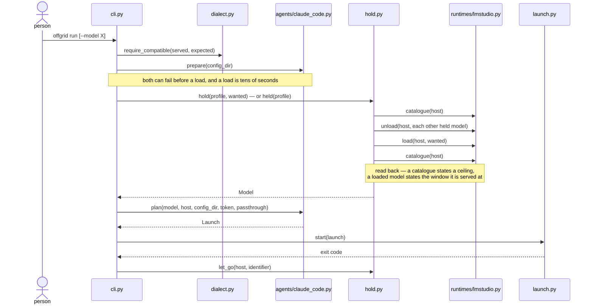
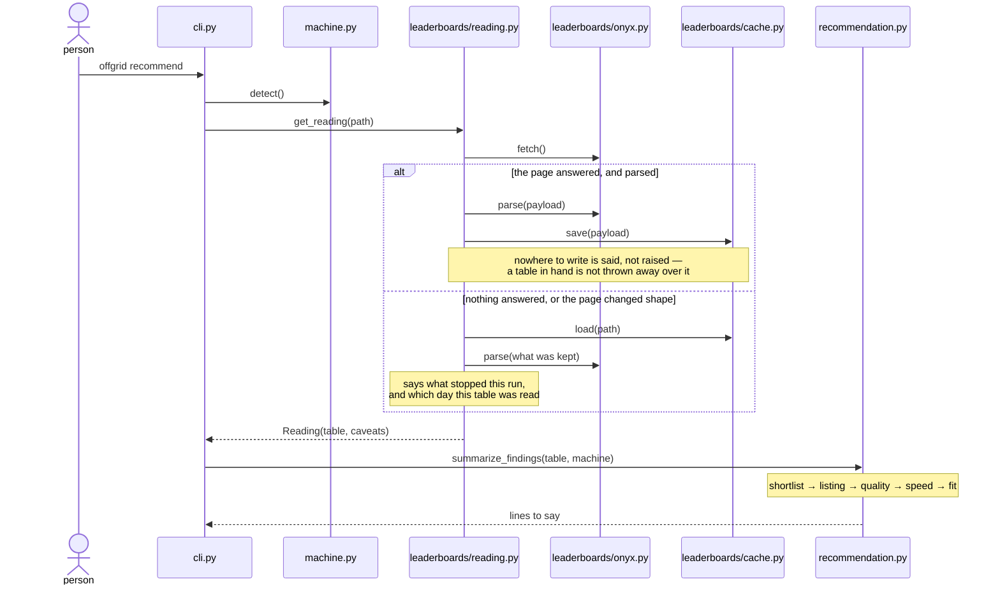
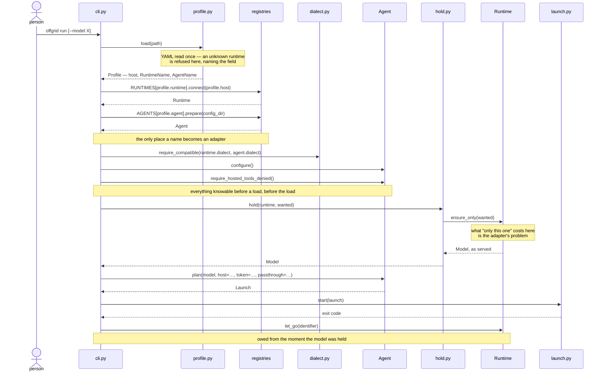

# Architecture

Where a change goes, what may import what, and the seams a second runtime and
a second agent attach at. The words used here are defined in `CONTEXT.md`, and
what was decided and why is in `docs/decisions.md`.

Every section is marked **built** or **designed**. Built describes `v0.1.0`.
Designed is what is being built next and does not exist yet — read it as the
target, not as the code.

## The layers — built


Dependencies point inwards: adapters know about the domain, the domain knows
nothing about adapters. The command line is outermost and may reach anything;
`shared` is innermost and reaches nothing of offgrid's.

The dotted edge is the exception, and closing it is what the seams below are
for.

### What checks this — built

`import-linter` states the rule as two contracts in `pyproject.toml`, and the
hooks run them on every commit, so a broken layer fails rather than waiting to
be spotted in review. `uv run lint-imports` runs them by hand.

The first contract is the rule above. The second is that no adapter reaches
for another: `runtimes/`, `agents/` and `leaderboards/` do not know each other
exists.

The first carries one exemption — `offgrid.hold -> offgrid.runtimes.lmstudio`,
the dotted edge — which the commit that builds the port deletes. So the check
is also the answer to whether that work is finished.

### What it tightens to — designed

Once `cli.py` and `hold.py` see only a Protocol and a registry, the rule stops
being "the domain may not import adapters" and becomes **nothing may import a
concrete adapter except its own registry**. The exemption disappears rather
than moving, and `runtimes/lmstudio.py` gains exactly one importer.

## The modules — built

**command line**

```
cli.py             setup, doctor, recommend, run
```

**adapters**

```
runtimes/          one module per runtime
  lmstudio.py      the catalogue, what is held, loading and letting go
agents/            one module per agent
  claude_code.py   the environment and arguments that point it at the runtime
leaderboards/      one module per published list
  onyx.py          fetching and parsing the page
  cache.py         keeping the last payload that parsed
  reading.py       which table to answer from, and what to say about it
```

**domain**

```
machine.py         what this Mac is, and how to give its GPU more room
fit.py             how much room it has
model.py           a model the runtime describes
listing.py         a model a published list describes, and which ones fit
speed.py           how fast this machine reads a model's weights
quality.py         how good a fit is, as one number and one word
shortlist.py       what fits, ranked, and what each rule dropped
recommendation.py  how that reads to whoever asked
dialect.py         which API shapes can be paired
profile.py         what is remembered between runs
launch.py          an environment and an argument list, and running one
hold.py            holding the model that answers, and letting it go
```

**shared**

```
exceptions.py      the errors offgrid raises on purpose
say.py             how offgrid talks to whoever ran it
```

Files stay under 150 lines and are organised by domain rather than by kind, so
a module that outgrows the limit is usually two ideas rather than one long one.

## What happens on `offgrid run` — built



The order is the design here, not an accident of how the code was written.

The dialect check and the agent's settings check both run *before* the load,
because both are knowable in advance and a load is tens of seconds nobody gets
back. From the moment a model is held, letting go is owed whatever happens —
so the launch sits in a `try`, `let_go` sits in the `finally`, and a failed
load lets go of the weights the runtime may have taken anyway.

The model is read back from the catalogue after loading rather than trusted
from before it. A catalogue entry states a model's ceiling; a loaded one
states the window it is actually served at. Sizing an agent's context from the
ceiling means the agent never compacts and the runtime truncates the prefix
instead, which is the failure compacting exists to avoid.

Every model but the one being asked for is let go first: one machine, one pool
of memory, and what is held is memory the rest of the machine cannot use.

## What happens on `offgrid recommend` — built



A published list is somebody else's site, and the machine reading it may have
no network at all. So a stale table answers when a current one cannot, and how
old it is is said every time it is used. A payload is kept only once it has
parsed — keeping one that did not would take the fall back away at the moment
it is all the command has left.

`setup` and `doctor` are linear and need no diagram. `setup` measures the
machine, writes the profile and says what fits. `doctor` asks the runtime what
it is holding and prints it beside the agent's dialect.

## Where a port lives — designed

`Runtime`, `Agent`, `Capabilities` and `Leaderboard` are domain types. They sit
beside the code that needs them, and never inside `runtimes/`, `agents/` or
`leaderboards/`.

That is the layer rule rather than a preference. The contract forbids
`offgrid.hold -> offgrid.runtimes`, and a forbidden module covers everything
beneath it, so a `Runtime` declared in `runtimes/__init__.py` is one the domain
cannot import without committing the violation the exemption exists for today
— which is the thing this design deletes.

So the consumer declares what it needs. `Runtime` and `Capabilities` beside
`hold.py`, its only caller; `Agent` beside `launch.py`, which already owns the
`Launch` that `plan` answers with. The adapter packages hold implementations
and nothing else, and each becomes importable from exactly one place: its
registry.

The alternative is a pair of domain modules called `runtime.py` and `agent.py`,
which is easier to find and puts `offgrid/runtime.py` one letter from
`offgrid/runtimes/` in every import line that mentions either.

## The runtime seam — designed

A runtime adapter is a module exposing one factory. The factory binds an
address once and answers with something satisfying `Runtime` — a frozen
dataclass holding the host, with methods, inheriting nothing. The Protocol is
a class and so is what satisfies it; neither is a base of the other, and `ty`
checks the match structurally.

```python
Connect = Callable[[str], Runtime]


class Runtime(Protocol):
    dialect: Dialect
    capabilities: Capabilities

    def read_catalogue(self) -> list[Model]: ...
    def read_held(self) -> list[Model]: ...
    def ensure_only(self, identifier: str) -> Model: ...
    def let_go(self, identifier: str) -> bool: ...
```

Six members, each with a caller today. No payload crosses it, and nothing
about the order of calls is knowledge the caller has to hold.

**Two are attributes and four are actions, and the split says something.** An
attribute is settled when the connection opens: reading it is free and cannot
fail. A method reaches the server, so it costs time and can raise. Naming a
method for what it does — `read_held`, not `held` — is the difference between
an interface that says which of its members touch the network and one that
leaves a caller to find out.

A Protocol rather than typed callables because a connection carries state —
the host, LM Studio's `instance_id`, the capabilities probed when it opened —
and because six related members read better named than positional. The
leaderboard seam below carries neither and is shaped differently for it.

**`ensure_only` states an intent, not a mechanism.** The domain wants one model
in memory on a machine with one pool; how a runtime reaches that differs
enough that it cannot be orchestrated from outside. `docs/research/adapter-surfaces.md`
records four ways: LM Studio takes `POST /api/v1/models/unload` per instance;
Ollama takes an empty request with `keep_alive: 0`, which hits a branch calling
`expireRunner` synchronously; oMLX takes `POST /v1/models/{id}/unload` and
awaits it, and *also* evicts on its own against a memory ceiling; a
single-model `llama-server` cannot be asked at all, because the model is the
process. `_let_go_of_the_rest` works against exactly one of those four.

**`let_go` stays**, because the end of a run is a different question from the
start of one: `run` owes a release in its `finally` whatever happened, and that
is one model by name rather than an intent about the whole pool.

**`models()` and `held()` are separate** because for three of the four they are
separate requests — Ollama answers `/api/tags` and `/api/ps`, oMLX answers
`/v1/models` and `/v1/models/status`. LM Studio answers both from one payload,
which is why today's interface hands that payload around. That is LM Studio's
efficiency, and an adapter that wants it can hold the payload behind the seam.

**`capabilities()` hangs off the connection, not the module**, because one of
the three varies by how the server was started: a `llama-server` in router mode
exposes `POST /models/unload` and the same binary started with a model does
not. It costs one call at connect.

```python
@dataclass(frozen=True)
class Capabilities:
    counts_tokens: bool
    release_can_be_commanded: bool
    manages_its_own_memory: bool
```

Three, because each changes what offgrid does rather than what it reports.
Without `count_tokens` the agent counts context through the messages endpoint
instead, which on this machine spends the one model being held. Without a
commandable release, `ensure_only` cannot promise what its name says. A runtime
that manages its own memory can undo the promise a second after it is made.

## The agent seam — designed

The same shape: a module exposing one factory, binding the configuration
directory once.

```python
Prepare = Callable[[Path], Agent]


class Agent(Protocol):
    dialect: Dialect

    def configure(self) -> None: ...
    def require_hosted_tools_denied(self) -> None: ...
    def plan(
        self,
        model: Model,
        *,
        host: str,
        token: str,
        passthrough: list[str],
    ) -> Launch: ...
```

**`configure` and the guarantee are separate calls** because they are separate
jobs. `configure` writes what is missing and leaves alone what a person edited;
`require_hosted_tools_denied` refuses a configuration that would let the agent
reach for a tool it cannot run. Today both live inside `prepare`, and the
second one is the privacy promise in `docs/decisions.md` made executable.

It is a slot in the port rather than one adapter's business because the failure
it guards is silent. A hosted tool called against a local model returns invented
prose that reads as an answer, with no error anywhere. Codex CLI carries
`supports_standalone_web_search`, so the second agent has the same class of
tool — and without a named slot, its adapter ships without the guard and
nothing says so.

**`plan` returns a `Launch` and writes nothing.** An environment and an
argument list can be shown before anything runs, which is the whole reason
`Launch` exists. Three agents configure themselves three different ways —
Claude Code entirely through environment variables, OpenCode through an
`opencode.json` provider block, Codex through a `[model_providers.*]` table in
`~/.codex/config.toml` — and that difference belongs inside `configure`, not
smuggled into `plan` as a side effect.

## The leaderboard seam — designed

Not a Protocol, and the difference is the point. A published list holds no
state and answers two questions, so it is two typed callables kept together
rather than an object.

```python
Fetch = Callable[[], str]
Parse = Callable[[str], Table]


@dataclass(frozen=True)
class Leaderboard:
    fetch: Fetch
    parse: Parse
```

Paired in a record rather than registered separately, because parsing one
list's payload with another list's parser is nonsense and nothing else would
stop it.

`leaderboards/reading.py` composes one of these with `cache.py` and answers
with a `Reading`. It reaches the registry rather than naming `onyx` directly.

The two shapes cannot be mixed: a record of callables does not satisfy a
Protocol whose members are methods, because a bare `Callable` takes its
parameters positionally where a method permits them by name. Each seam is one
or the other.

## Choosing an adapter — designed

The names are enums in the domain, beside the other enum offgrid already has.

```python
class RuntimeName(Enum):
    LMSTUDIO = "lmstudio"


class AgentName(Enum):
    CLAUDE_CODE = "claude-code"
```

`profile.runtime` is then a `RuntimeName` rather than a string, and pydantic
refuses an unknown one when the profile is read — `Input should be
'lmstudio'`, naming the field, before anything else runs. That is what the
profile is for: it is hand-edited, and a name offgrid does not have is a
mistake to report rather than a preference to record.

Each adapter package holds a dict keyed by that enum, and a lookup.

```python
RUNTIMES: dict[RuntimeName, Connect] = {RuntimeName.LMSTUDIO: lmstudio.connect}
AGENTS: dict[AgentName, Prepare] = {AgentName.CLAUDE_CODE: claude_code.prepare}
```

This is what finally makes `profile.runtime` and `profile.agent`
load-bearing: today they are validated and then ignored, and `cli.py` imports
both adapters by name.

**Two places, and a test that makes them agree.** The enum is the domain's
statement of what exists; the registry is the adapter layer binding a name to
an implementation. They cannot be one place — an enum that carried its own
factory would be a domain type importing an adapter, which is the violation
this design removes. So a test asserts `set(RUNTIMES) == set(RuntimeName)`,
the same guard as the module map, and adding an adapter that forgets its
registry entry fails rather than raising a `KeyError` at someone's terminal.

**The profile is written with `model_dump(mode="json")`.** A plain
`model_dump()` answers with the enum member, and `yaml.safe_dump` cannot
represent one — `RepresenterError: cannot represent an object`. The round-trip
tests in `tests/test_profile.py` catch it, but the type does not say so.

A dict keyed by an enum, rather than entry points or an importable path from
the profile. The
audience clones and runs, so plugin discovery buys extensibility for people who
do not exist, and a dotted path in a hand-edited YAML file is an import
statement in a config file. Adding an adapter is a module and one line, in a
place `rg` finds.

## What a run will look like — designed

The built diagram above draws the flow being replaced. This is the same run
once the seams exist, from the file on disk to the process starting.



Three things read off it that the prose says separately.

The profile is parsed once, at the top, and everything downstream holds types
rather than strings — `profile.runtime` is a `RuntimeName`, so the failure for
a hand-edited typo happens at `load` with the field named, not at a registry
lookup halfway through a run.

`cli.py` touches a registry twice and never again. After those two lines it
holds a `Runtime` and an `Agent` and knows nothing about which ones they are.

`ensure_only` is one arrow. The four calls it replaces — read the catalogue,
unload each other model, load, read back — are inside the adapter, which is
the only thing that knows whether its runtime needs four calls, one, or none.

`recommend` changes less: `LEADERBOARDS[…]` replaces `reading.py` naming
`onyx`, and the rest of that diagram stands.

## What crosses a seam — designed

`Model`, `Dialect`, `Capabilities`, `Launch`, `Table` — domain types, all of
them. No vendor payload, no `dict`, no HTTP object.

Adapters raise the domain's own exceptions from `exceptions.py`, as
`runtimes/lmstudio.py` already does. The alternative — adapter-specific error
types translated by the caller — would make the domain import adapter modules,
which the layer rule forbids and `import-linter` would catch. Translating
inside the adapter is also where it belongs for a reason the research turned
up: Claude Code's retry logic matches on the upstream's error *wording*, so
what a runtime's failure says is load-bearing in a way only its adapter knows.

## Why the shape changed — built, and the evidence for the design

Depth is leverage at an interface: how much behaviour a caller gets for each
thing it has to learn. It is a property of the interface rather than of what is
behind it, and it is what decides whether a seam is worth having.

There are three deep interfaces here already.
`plan(model, host, config_dir, token, passthrough)` hides the environment, the
argument list, the settings file and the context sizing behind one call.
`get_reading(path)` hides fetching, parsing, keeping the payload, falling back
on a kept one, and the sentence saying how old it is.
`summarize_findings(table, machine)` hides the whole chain from listing through
fit, speed and quality down to a ranked table.

The runtime's is the shallow one. `catalogue(host)` answers with the runtime's
payload, and `parse_models`, `loaded` and `resident` are functions over that
payload. Fetching once and asking three times is not something the interface
does; it is something the caller has to know to do. That knowledge is part of
the interface even though no signature carries it.

Imagine deleting that interface. `hold.py` would gain HTTP and JSON parsing,
and lose almost nothing else — the three payload functions collapse into asking
the runtime what it has. An interface whose removal costs that little is not
hiding much.

Which says the payload crossing the boundary better than calling it a leak.
`hold.py` presents a deep interface of its own — `held`, `hold`, `let_go` — and
it is deep by absorbing the shallowness underneath it. The dict is what
absorbing looks like from outside, and the designed `Runtime` above is that
absorption moved to the side of the seam that owns it.

`leaderboards/reading.py` is the counter-example in this repo. It composes two
narrow modules — `onyx.py` for one list, `cache.py` for the file — into one
deep call, and no payload reaches whoever asked. `hold.py` composes one module
into an equally deep call and wears the payload anyway. Same job, same
coupling, one hiding what the other carries.

## The candidates the design answers to — built

`CONTEXT.md` names Ollama as a candidate runtime and OpenCode as a candidate
agent; issue #19 weighs oMLX and records what was measured on this machine.
`docs/research/adapter-surfaces.md` records what each documents, and what its
source says where the documentation is silent.

| | dialects served | told to let go by | what is held |
|---|---|---|---|
| LM Studio | both | `POST /api/v1/models/unload`, or `lms unload` | `loaded_instances`, per model |
| Ollama | both | an empty request with `keep_alive: 0` | `GET /api/ps`, apart from `/api/tags` |
| oMLX | both | `POST /v1/models/{id}/unload`, awaited | `GET /v1/models/status` |
| llama.cpp | both | router mode only; a timer otherwise | router mode only |

**Every candidate serves both dialects.** All four expose `POST /v1/messages`
and `POST /v1/chat/completions`. So "a runtime serves one dialect" is not what
any of them is, and `require_compatible` may have no real pair left to refuse
among runtimes. It still earns its keep on the agent side: Codex CLI accepts
only the Responses API as of `rust-v0.147.0`, where `WireApi` has one variant
and `wire_api = "chat"` is a named error.

What `Dialect` cannot express is that LM Studio answers `200` to
`/v1/messages/count_tokens` while logging `Unexpected endpoint or method`,
which is worse than a `404` because a caller cannot tell "counted zero" from
"not implemented". That is what `Capabilities` is for (#43).

## What follows outside the ports — designed

**The profile carries a name, not a string.** `runtime` and `agent` become the
enums above, so a hand-edited typo is refused when the profile is read and
`profile.runtime` is a type at every call site. `save` writes with
`model_dump(mode="json")`, since YAML cannot represent an enum member.

**The profile stops carrying a machine.** `Profile.machine()` has no callers,
and `setup` and `recommend` both call `detect()` fresh, so `chip`,
`memory_bytes` and `wired_limit_bytes` are written and never read. They go.
`setup` keeps measuring and printing — that is its job, and the GPU advice is
its value. Old profiles fail to load and the error already says to run `setup`
again; no compatibility shim.

This also settles #42 for every runtime rather than one: a limit read at the
point of use is right even when a runtime moves it at startup, which oMLX does.

**`cli.py` is where a name becomes an adapter, and the only thing that knows
one exists.** It reads the profile, asks a registry for a `Runtime` and an
`Agent`, and hands them to the code that uses them. It imports the registries
and the Protocols and never `lmstudio` or `claude_code`, which is what makes
the rule statable: **only a registry may import a concrete adapter**, the
command line included. "Outermost, so it may import anything" is not something
a contract can check.

It keeps the commands, the reporting and the exit codes, and it keeps the
order of a run — the checks before the load, the `try`/`finally` that owes the
release, which is what has to survive Ctrl-C (#11). Whether that order belongs
in a domain module instead is #12's question, and it is answerable once the
adapter imports have gone and `cli.py`'s real size is known rather than
guessed. There is one caller today.

## How this is tested — designed

Three different things, and conflating them is how a suite ends up testing
itself.

**Through the command, standing in below the adapter.** This is what the suite
already does and what most tests should keep doing: `tests/doubles.py` answers
`httpx.get` from a `MockTransport` carrying a captured payload, and stands in
for `subprocess.run` and `subprocess.Popen`. One test then covers the ordering
*and* the adapter's parsing, against a real payload. A fake satisfying
`Runtime` would skip the parsing, which is the half most likely to be wrong.

**Each adapter, against a conformance suite.** One suite states what being a
runtime means behaviourally — that `ensure_only` answers with the model as
*served* rather than as catalogued, that `read_held` reflects reality after a
`let_go`, which error arrives when the host is unreachable — and every adapter
runs it against payloads captured from that runtime, live. An adapter is done
when it passes.

**A fake `Runtime` only where the socket cannot reach.** It is the exception,
not the default: something satisfying the Protocol proves how the domain
behaves when a runtime does something awkward to arrange for real. It proves
nothing about any adapter, and reaching for it first is how a suite ends up
testing itself.

Fixtures stay captured, never transcribed from documentation. The research is
exactly the tempting source, and it also found that LM Studio's docs describe
0.4.1 while the app ships 0.4.20, with three open regressions on the endpoint
offgrid uses. Documentation-derived fixtures would test the documentation.

**The shape, by the type checker.** `ty` verifies a module against a Protocol —
a mismatched parameter reports `protocol member ... is incompatible` — so
structural conformance needs no test at all.

## What is not decided

- Where "do not reason before answering" lives (#40). offgrid never sends a
  request, so it has no per-request knob; its levers are the agent's
  environment and whatever server-side default a runtime takes. Out of the
  ports, possibly a `doctor` warning.
- Whether `leaderboards/reading.py` belongs in the adapter package or beside
  `hold.py` in the domain (#48). Nothing forces it while there is one list;
  the registry makes it live, since a module that dispatches over one is
  policy rather than an adapter.
- Whether a cold prefill outlasts the agent's stream watchdog (#45), and what
  the auto-compact window should be when the agent clamps it above what the
  runtime serves (#46). Both are launch-time facts about a pairing, and both
  need a live run rather than more reading.
