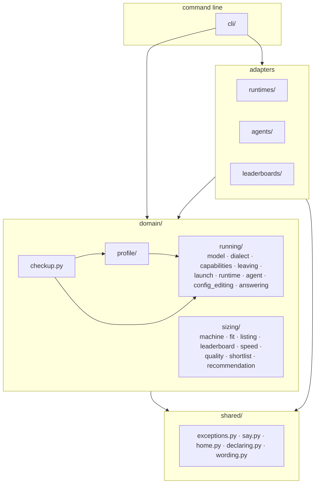
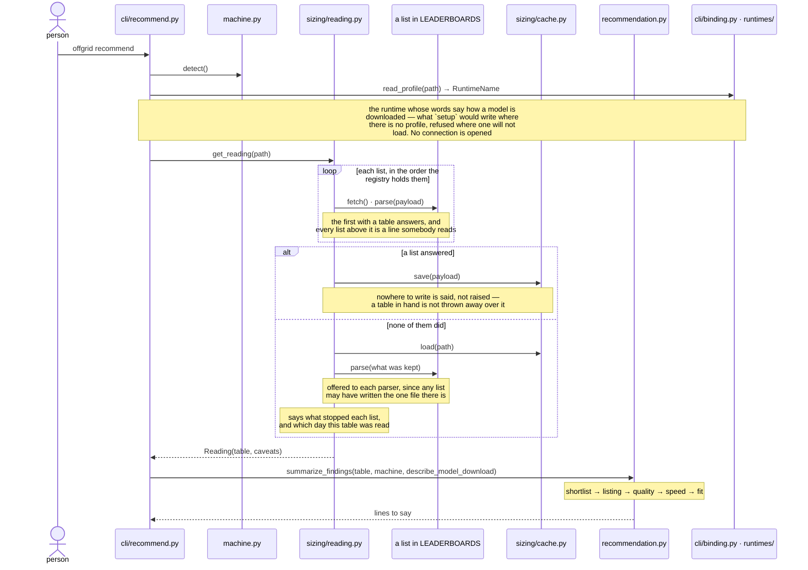

# Architecture

Where a change goes, what may import what, and the seams a second runtime and
a second agent attach at. The words used here are defined in `CONTEXT.md`, and
what was decided and why is in `docs/decisions.md`.

Every section is marked **built** or **designed**. Built describes `v0.1.0`.
Designed is what is being built next and does not exist yet — read it as the
target, not as the code.

## The layers — built



Dependencies point inwards: adapters know about the domain, the domain knows
nothing about adapters. The command line is outermost and may reach anything;
`shared` is innermost and reaches nothing of offgrid's.

Each of these is a folder, so the tree says which layer a module is in and a
new one lands somewhere on purpose. It is also what lets the contracts be
stated over one name per layer rather than every module by hand.

`running/answering.py` reaches `running/runtime.py`, which is a port and not an
adapter: what satisfies it is bound to a name in `runtimes/`, and `cli/` is
where the two meet. `running/agent.py` stands the same way to `agents/`, and
`sizing/leaderboard.py` to `leaderboards/`. All three seams are ports with a
registry behind them.

### What checks this — built

`import-linter` states the rule as four contracts in `pyproject.toml`, and the
hooks run them on every commit, so a broken layer fails rather than waiting to
be spotted in review. `uv run lint-imports` runs them by hand.

The first contract is the rule above: `offgrid.domain` reaches no adapter. The
second is that `offgrid.shared` reaches nothing of offgrid's at all, which is
what makes it the innermost layer rather than a place things are put. The
third is that the two halves of the domain do not know each other: nothing
under `sizing/` imports anything under `running/`, or the reverse. The fourth
is that no adapter reaches for another: `runtimes/`, `agents/` and
`leaderboards/` do not know each other exists.

Three of them are stated over one name per layer, so a module is covered by
living in the layer rather than by being remembered. The third is the exception
and is stated inside a layer, over the two halves of the domain.

`domain/profile/` is deliberately in none of them. It depends on `running/`,
which is what a profile is for — naming the adapters a run uses — so it could
not sit on either side of that contract without making it assert something
softer than it does.

The first carried one exemption — `offgrid.hold -> offgrid.runtimes.lmstudio`
— which the commit that built the runtime port deleted. It is stated without
exemptions now.

### What a contract cannot check — built

The four contracts say nothing about `cli/`, which is outermost and may
import anything. The rule that holds over it too is **only a registry may
import a concrete adapter**, the command line included, and each adapter
package has exactly one importer from outside it: the registry in its own
package's `__init__.py`.

`import-linter` cannot state that one. It reads import statements as written,
and `from offgrid.leaderboards import onyx` in the registry beside `onyx.py` is
the same statement as a command writing it — a `forbidden` contract would refuse
both or neither. So `tests/test_architecture.py` carries it instead, reading
every import in `src/` against the adapters it finds in the tree. Finding them
rather than listing them is what covers an adapter written later: the second
runtime is inside the rule the day its directory exists, without anyone
editing the test.

The unit is the package rather than the module, because an adapter's own files
import each other: `lmstudio/lmstudio.py` reaches `lmstudio/catalogue.py` for
the payload it reads. What the rule forbids is reaching *into* an adapter from
outside it, which is what a second adapter, the domain, or the command line
would be doing.

## The modules — built

**command line**

```
cli/               the layer, a module per command and the four attached
  setup.py         measure this machine, and write the profile
  doctor.py        what can be read before a run costs a load
  recommend.py     what a published list says this machine can hold
  run.py           hold a model, start the agent, let the model go
  reporting.py     what offgrid's own errors look like at the terminal
  binding.py       the profile read, and both adapters it names bound
```

**adapters**

```
runtimes/          one package per runtime
  lmstudio/
    lmstudio.py    what a runtime is asked, in LM Studio's terms
    serving.py     which dialects it serves and what it can be asked,
                   settled without reaching it
    config.py      what it is reached with, as a profile says it
    catalogue.py   what it has, and what it is holding
    holding.py     taking a model into memory, and letting one go
agents/            one package per agent
  claude_code/
    claude_code.py what an agent is asked, in Claude Code's terms
    config.py      what it is run out of, as a profile says it
    configuring.py what offgrid writes into its directory, and what
                   that directory carries besides it
    launching.py   the arguments and sizes it is started with, and
                   what is read back out of them
    compacting.py  what it compacts against, and what is said where
                   it will not
    hosted_tools.py  whether WebSearch can still be reached, out of the
                   settings and the argument that loads them
    publishing.py  whether an argument runs the session in the cloud
                   instead, which no setting decides
  opencode/
    opencode.py    what an agent is asked, in OpenCode's terms
    config.py      what it is run out of, as a profile says it
    configuring.py what offgrid writes into its directory, which is
                   only what offgrid never revises, and the names of
                   what sits under that directory, the store a
                   conversation lands in among them
    launching.py   the configuration a run derives, and the command
                   it is started with
    cautioning.py  what a run takes away and what it leaves unsized,
                   said before it starts
    hosted_tools.py  that it offers none, and the tool list that was
                   measured to say so
    sharing.py     whether an argument or the file could let a transcript
                   leave, the argument read first
leaderboards/      one module per published list, and the registry
  onyx.py          fetching and parsing the page
```

**domain**

```
domain/
  checkup.py       what a run can be told before it costs a load, and
                   how it reads — the readings about what could leave
                   among them
  sizing/          what this machine has room for
    machine.py     what this Mac is, and how to give its GPU more room
    fit.py         how much room it has
    listing.py     a model a published list describes, and which ones fit
    leaderboard.py what offgrid asks of a published list
    reading.py     which list and which table to answer from, and what
                   to say about it
    cache.py       keeping the last payload that parsed
    speed.py       how fast this machine reads a model's weights
    quality.py     how good a fit is, as one number and one word
    shortlist.py   what fits, ranked, and what each rule dropped
    recommendation.py  how that reads to whoever asked
  running/         what a run is made of
    model.py       a model asked for and a model described, and which of
                   two askings wins
    context_window.py  which windows a run cannot be held at, and the
                   numbers deciding that
    dialect.py     which API shapes can be paired
    capabilities.py  what a runtime can be asked to do
    leaving.py     what a run could send off this machine, and
                   whether that stops it
    conversations.py  where an agent keeps what it wrote down of a
                   session, and the way back into one
    launch.py      an environment and an argument list, and running one
    runtime.py     what offgrid asks of a runtime, and which ones there are
    agent.py       what offgrid asks of an agent, and which ones there are
    agent_presence.py  whether the agent is on this machine, and where it
                   is published from where it is not
    config_editing.py  whether a configuration file holds an edit to
                   keep, and what is refused rather than guessed about
    answering.py   which model answers, and making it the one that does
    asking.py      what a run will ask for, said before it asks
    discarded_windows.py  which windows a runtime was asked for and did
                   not grant, kept between runs
    discarding.py  whether a window is asked for again, and what became
                   of the one that was
  profile/         what is remembered between runs
    profile.py     the file, and what is read out of it
    keeping.py     reading and writing YAML without losing the comments,
                   the blank lines and the order somebody typed
    saving.py      writing it where a later run will find it
    restating.py   what a save writes over the file that is there, and
                   when it writes a whole one instead
    refusing.py    what a section offgrid cannot read reads like
    structure.py   whether it is built the way offgrid reads one
```

`checkup.py` sits directly under `domain/` rather than inside one of the three
because it is made of two of them: it reads a `Profile` and what `running/`
answered, and putting it under either would point an arrow the other three do
not have. It is in the domain rather than beside a command because two surfaces
show it — the report `doctor` prints and the screen bare `offgrid` opens — and a
sentence living in one of them is a sentence the other has to word again.

`leaderboard.py` sits under `sizing/` rather than beside the other two ports
because what it answers with is a `Table`, and a table is what fits. A port
lives with the half of the domain that uses it, and `reading.py` beside it is
what uses this one.

The tree is the layers, so a module's place says which one it is in and the
contracts are stated over four names rather than every module by hand. It also
puts `domain/running/runtime.py` two folders away from `runtimes/` instead of
one letter.

**shared**

```
shared/
  exceptions.py    the errors offgrid raises on purpose
  say.py           how offgrid talks to whoever ran it
  home.py          where offgrid keeps what it remembers
  declaring.py     reading a config as the adapter that declared it
  wording.py       the word for a number somebody else did not state
```

Shared is what reaches nothing of offgrid's own, which is the test as well as
the description: every one of these imports only the standard library or a
dependency, so any layer may reach them without a cycle to think about.

Files are organised by domain rather than by kind, and a module past 200 lines
is worth asking about: it is usually two ideas rather than one long one. Asking
is all the number does — nothing enforces it, and `docs/decisions.md` says why.

## What happens on `offgrid run` — built

```mermaid
sequenceDiagram
    actor P as person
    participant C as cli/run.py
    participant F as profile.py
    participant G as registries
    participant D as dialect.py
    participant A as Agent
    participant H as answering.py
    participant W as discarding.py
    participant R as Runtime
    participant L as launch.py

    P->>C: offgrid run [--model X]
    C->>F: load_yaml(path)
    F-->>C: the file, as the mapping it holds
    C->>G: create_runtime_config(said) · create_agent_config(said, host)
    Note over G: the name picks the class, and the class says<br/>which of the rest of the section it accepts
    G-->>C: RuntimeConfig · AgentConfig
    C->>F: create_profile(body, runtime, agent)
    F-->>C: Profile
    C->>G: connect_runtime(profile.runtime)
    G-->>C: Runtime
    C->>G: prepare_agent(profile.agent, passthrough)
    G-->>C: Agent
    Note over C,G: the only place a name becomes an adapter, and<br/>where a key its adapter does not read is refused
    C->>D: require_compatible(runtime.dialects, agent.dialect)
    C->>A: configure()
    C->>A: read_what_leaves_this_machine()
    A-->>C: one Reading per way off this machine
    C->>C: require_nothing_leaves(readings)
    Note over C,A: everything knowable before a load, before the load
    C->>W: read_discarded_windows(runtime, host, file_path)
    W-->>C: every window this runtime discarded, by model and window
    C->>H: hold_model(runtime, model_request, agent.context_floor, was_window_refused_func)
    Note over H: either half may be none: no model asks for whatever is<br/>held, no window asks for whatever it is served at
    H->>H: refuse a window below the floor or above the ceiling
    Note over H: still before the load, and the ceiling is one<br/>catalogue read against tens of seconds
    H->>H: drop a window this runtime refused before
    Note over H: only that window, read from what the command line<br/>already has: a different one is a question it has not been put
    H->>R: ensure_only(model_request) — or read_held()
    Note over R: what "only this one, at that window" costs here is the<br/>adapter's problem: let go of the rest, load, read back
    R-->>H: Model, as served
    H-->>C: Model
    C->>C: refuse a served window below the floor
    Note over C: the load is spent either way; what this saves is<br/>the agent starting and failing on its own terms
    C->>W: read_what_became_of_the_window(discarded_windows, request, model)
    W-->>C: what to say, and whether it is worth keeping
    C->>W: save_discarded_window_if_new(...)
    Note over C,W: only where the runtime refused it this run: one<br/>already on record was never put to it again
    C->>A: plan(model)
    A-->>C: Launch
    C->>L: start(launch)
    L-->>C: exit code
    C->>R: let_go(identifier)
    Note over C,R: owed from the moment the model was held
```

The order is the design here, not an accident of how the code was written.

The dialect check and the hosted-tool reading both run *before* the load,
because both are knowable in advance and a load is tens of seconds nobody gets
back. The two window refusals sit there for the same reason, one either side
of the number asked for: below the agent's floor it does not start, and above
the model's ceiling the runtime takes the number without complaint and serves
one the model cannot honour. `context_window.py` holds both, `hold_model` calls them,
and each names the window asked for beside the number it broke.

A window this runtime refused before is dropped after those two rather than
instead of them: a number that could never work is worth saying so about
whether or not offgrid means to send it, and the refusals are what say it. The
records are read once by the command line and handed in, so the question of
what to ask for and the question of what to say about it are answered from the
same file read at the same moment. Only the window that was refused is
dropped — a different one is a question this runtime has not been put, and
dropping it would throw away a number somebody typed on the strength of an
answer about another one.

The floor is then measured a second time, against the window the runtime
settled on rather than the one it was asked for — the two are different
numbers, and only the second one starts the agent. A run that named no window
inherits whatever the runtime last remembered, and a runtime is free to honour
a number it was given with another, so this is the only check that covers
every way of arriving at a window too small. It cannot come before the load,
which is why it is a separate refusal rather than the same one: what it saves
is not the load but the agent starting and failing on its own terms, with an
error about an initial prompt rather than about the window that could not hold
it.

The two kinds of refusal leave the pool differently, and the line between them
is where offgrid starts owning it. Refused before the load, nothing has been
touched and nothing is let go of — what was held before the command is what is
held after it. Refused after, the refusal is inside the stretch that owes a
release whatever happens, so the model goes, including one offgrid found
rather than loaded. That is the same rule a finished run follows: it lets go
of a model it merely found too, because one machine has one pool.

From the moment a model is held, letting go is owed whatever happens — so the
launch sits in a `try`, `let_go` sits in the `finally`, and a failed load lets
go of the weights the runtime may have taken anyway.

The model is read back from the catalogue after loading rather than trusted
from before it. A catalogue entry states a model's ceiling; a loaded one
states the window it is actually served at. Sizing an agent's context from the
ceiling means the agent never compacts and the runtime truncates the prefix
instead, which is the failure compacting exists to avoid.

Every model but the one being asked for is let go first: one machine, one pool
of memory, and what is held is memory the rest of the machine cannot use.
That is one arrow here and four calls inside the adapter, which is the only
thing that knows whether its runtime needs four, one, or none.

The profile is parsed once, at the top, and everything downstream holds types
rather than strings: a hand-edited typo fails at `load` with the field named,
not at a registry lookup halfway through a run.

## What happens on `offgrid recommend` — built



A published list is somebody else's site, and the machine reading it may have
no network at all. So a stale table answers when a current one cannot, and how
old it is is said every time it is used. A payload is kept only once it has
parsed — keeping one that did not would take the fall back away at the moment
it is all the command has left.

The kept table is the last resort rather than the second option, because a
current table from a list further down the registry beats one read a fortnight
ago. Which list the figures came from is then said, since two lists score on
different benchmarks and a row is only comparable to the rest of its own
table.

`setup` and `doctor` are linear and need no diagram. `setup` measures the
machine, writes the profile and says what fits. `doctor` asks the runtime what
it is holding and prints it beside the dialects the runtime serves and the
one the agent speaks.

## What the profile carries — built

A section per port and one for the model. `runtime` names its adapter and says
where it listens; `agent` names its adapter; `model` says what to run and at
what window, and belongs to neither adapter — the agent sets the floor, the
runtime honours the number, and the model states the ceiling. An adapter with
settings of its own puts them in its own section, which is what the second
agent needs: opencode learns where the runtime listens from a
`provider.<name>.options.baseURL` block rather than from a variable naming the
address, so its adapter has to be told the host. Which half of opencode's
configuration ends up stating it is `docs/decisions.md`'s business; what the
profile settles is that the agent's section carries it.

```yaml
runtime:
  name: lmstudio
  host: 127.0.0.1:1234
agent:
  name: claude-code
model:
  identifier: qwen/qwen3.6-35b-a3b
  context_window: 32768
```

The `model` section is a `ModelRequest`, the same type `--model` and
`--context-window` build and the runtime port takes. `settle_what_to_run` puts
the two together key by key, so a flag naming only the model keeps the window
the file asks for, and `setup` writes the section even where it says nothing so
both keys are there to edit.

A profile written flat, or one naming a model on the `model` key itself, is
refused with the shape it now wants rather than the first key that no longer
fits. It is a hand-edited file on a clone-and-run project, and a silent
migration of one is worse than a clear refusal.

Nothing measured: `setup` and
`recommend` each call `detect()` where they need it, so a chip, a memory size
and a GPU limit recorded here would be a second answer to a question the
machine answers for itself — and a stale one from the first reboot, or from a
runtime that raises the limit as it starts. A profile written while it carried
them is refused, naming each field and saying to run `setup` again. No
compatibility shim.

`setup` still measures, still prints what fits at each quantization width and
still suggests raising the GPU limit. That is what it is for; the advice is its
value.

This settles #42 for every runtime rather than one: a limit read at the point
of use is right even when a runtime moves it at startup, which oMLX does.

## Where a port lives — built

`Runtime`, `Agent`, `Capabilities` and `Leaderboard` are domain types. They sit
beside the code that needs them, and never inside `runtimes/`, `agents/` or
`leaderboards/`.

That is the layer rule rather than a preference. The contract forbids
`offgrid.hold -> offgrid.runtimes`, and a forbidden module covers everything
beneath it, so a `Runtime` declared in `runtimes/__init__.py` is one the domain
could not import at all.

Each gets its own module, holding everything the domain says about that kind of
adapter and nothing else:

```
runtime.py         what offgrid needs of a runtime, and which ones there are
agent.py           what offgrid needs of an agent, and which ones there are
leaderboard.py     what offgrid needs of a published list
```

`runtime.py` holds `Runtime`, `RuntimeConfig` and `RuntimeName`; `agent.py`
holds `Agent`, `AgentConfig` and `AgentName`; `capabilities.py` beside them
holds `Capabilities`; `leaderboard.py` holds `Leaderboard`, `Fetch`
and `Parse`. The adapter packages hold implementations and their registry, and
each concrete adapter becomes importable from exactly one place: that registry.

Their own modules rather than declared inside the code that calls them. A
contract nobody can find is one a second adapter is written without: the module
map is how this repo says where things are, and a `Runtime` inside `answering.py`
has no line in it.

`cli/setup.py` imports both — the port for its types, the registry to build
one — and they read as what they are now that the layers are folders:
`domain/running/runtime.py` and `runtimes/`, rather than two names one letter
apart at the same level.

## The runtime seam — built

A runtime adapter is a module exposing a config and a factory. The config
says what the profile's runtime section may hold; the factory binds one and
answers with something satisfying `Runtime` — a frozen dataclass
holding the host, with methods, inheriting nothing. The Protocol is a class and
so is what satisfies it; neither is a base of the other, and `ty` checks the
match structurally.

```python
Connect = Callable[[RuntimeConfig], Runtime]


class Runtime(Protocol):
    @property
    def dialects(self) -> frozenset[Dialect]: ...
    @property
    def capabilities(self) -> Capabilities: ...

    def read_catalogue(self) -> list[Model]: ...
    def read_held(self) -> list[Model]: ...
    def ensure_only(self, model_request: ModelRequest) -> Model: ...
    def let_go(self, identifier: str) -> bool: ...
```

Six members. No payload crosses it, and nothing about the order of calls is
knowledge the caller has to hold.

**Two are attributes and four are actions, and the split says something.** An
attribute is settled when the connection opens: reading it is free and cannot
fail. A method reaches the server, so it costs time and can raise. Naming a
method for what it does — `read_held`, not `held` — is the difference between
an interface that says which of its members touch the network and one that
leaves a caller to find out.

**What a runtime says about downloading is not on the port**, because it is a
fact about a runtime rather than about a connection to one: it takes a model's
name, reaches nothing, and wants no address. It is a third mapping in the
registry, `MODEL_DOWNLOAD_INSTRUCTIONS`, keyed by `RuntimeName` alongside the
other two, so `recommend` asks it from the name a profile holds without opening
anything. `docs/decisions.md` has why.

The two attributes are declared as properties because that is what makes them
read-only. Written `dialects: frozenset[Dialect]`, a protocol attribute is one
a caller may also assign to, and what satisfies it here is frozen: `ty` refuses
the pair with `protocol member capabilities is incompatible — the member does
not accept writes`. A caller reads `runtime.dialects` either way.

A Protocol rather than typed callables because a connection carries state —
the host, the capabilities probed when it opened — and because six related
members read better named than positional. The leaderboard seam below carries
neither and is shaped differently for it.

**`ensure_only` states an intent, not a mechanism.** The domain wants one model
in memory on a machine with one pool; how a runtime reaches that differs
enough that it cannot be orchestrated from outside. `docs/research/adapter-surfaces.md`
records four ways: LM Studio takes `POST /api/v1/models/unload` per instance;
Ollama takes an empty request with `keep_alive: 0`, which hits a branch calling
`expireRunner` synchronously; oMLX takes `POST /v1/models/{id}/unload` and
awaits it, and *also* evicts on its own against a memory ceiling; a
single-model `llama-server` cannot be asked at all, because the model is the
process. Letting go of each other model in turn, from outside, works against
exactly one of those four, which is why it now sits inside the one it works
for.

**The window is part of that intent**, which is why it crosses the seam here
rather than being something each adapter reads out of a profile for itself —
that would point a dependency from an adapter at the profile, which the layer
rule forbids. Holding a model at a size is holding it with one more fact in
it, so the two travel as one `ModelRequest` rather than as a pair of
arguments threaded through four signatures. It is deliberately not a `Model`:
that is what the runtime answers with, and its window is the one being served
rather than the one being asked for.
Naming none inherits whatever the runtime last remembered, so a run that says
nothing about a window sends none. Reaching a new window is the
adapter's problem too: LM Studio serves a second copy rather than replacing
the first, so it lets go before it loads, and leaves a model already at the
window asked for alone rather than paying a reload for no change.

**`let_go` stays**, because the end of a run is a different question from the
start of one: `run` owes a release in its `finally` whatever happened, and that
is one model by name rather than an intent about the whole pool.

**`read_catalogue` and `read_held` are separate** because for three of the four
they are separate requests — Ollama answers `/api/tags` and `/api/ps`, oMLX
answers `/v1/models` and `/v1/models/status`. LM Studio answers both from one
payload, and now holds that payload behind the seam rather than handing it
around.

**`capabilities` hangs off the connection, not the module**, because one of the
three varies by how the server was started: a `llama-server` in router mode
exposes `POST /models/unload` and the same binary started with a model does
not. LM Studio's are the same however it was started, so its connection states
them without asking; one that varies costs a call at connect. Nothing reads
them yet — #43 is where the first caller is.

```python
@dataclass(frozen=True)
class Capabilities:
    counts_tokens: bool
    release_can_be_commanded: bool
    manages_its_own_memory: bool
```

Three, because each changes what offgrid does rather than what it reports.
Without `count_tokens` the agent counts context through the messages endpoint
instead, which on this machine spends the one model being held. Without a
commandable release, `ensure_only` cannot promise what its name says. A runtime
that manages its own memory can undo the promise a second after it is made.

## The agent seam — built

The same shape: a module exposing a config and a factory that binds one. What
it answers with is a frozen dataclass holding that config, with methods,
inheriting nothing.

```python
type Passthrough = tuple[str, ...]

Prepare = Callable[[AgentConfig, Passthrough], Agent]


@dataclass(frozen=True)
class AgentTerms:
    dialect: Dialect
    context_floor: int
    command: str


class Agent(Protocol):
    @property
    def terms(self) -> AgentTerms: ...
    @property
    def conversations(self) -> Conversations: ...

    def configure(self) -> None: ...
    def read_what_leaves_this_machine(self) -> tuple[Reading, ...]: ...
    def plan(self, model: Model) -> Launch: ...
```

Everything but the model is settled before a run starts, so an adapter is bound
to all of it and `plan` takes only what the run discovers. What is read to
decide whether a run is safe is then the same thing that gets launched.

`AgentTerms` is what the agent states about itself, and one value rather than
three members because the three share an invariant as well as a lifetime: each
is a fact about the agent that nothing outside it may set. `context_floor` is
the smallest window it can start in — an agent whose system prompt and tool
definitions do not fit fails at startup, which is a load already paid for.
`command` is what a launch runs, and what `PATH` is searched for before one is
built.

Its config carries the runtime's address, which its own section never says —
an agent that learns where to talk from a config file rather than from an
environment needs it before `configure` runs, and offgrid fills it from the
runtime's section rather than letting the file say it twice. The directory the
agent is run out of is derived from its own name, so nobody states it and
nothing can disagree about it.

**`configure` and the reading are separate calls** because they are separate
jobs. `configure` writes what is missing and leaves alone what a person edited
— including settings the reading will call permitted, which are an edit rather
than something to write over. `read_what_leaves_this_machine` says what this
run could send off this machine, and is the privacy promise in
`docs/decisions.md` made legible.

What counts as an edit is `domain/running/config_editing.py`, asked once for both
adapters, because deciding it per adapter is how one of them comes to decide it
by existence alone. A file that parses is an edit and is kept whole; a key
missing from it is not written back, since the key likeliest to be missing is
the one deciding something offgrid promised, and putting it back would answer a
person's deliberate edit with a run that quietly disagrees with their file.

It is a slot in the port rather than one adapter's business because the
failures it describes are silent. A hosted tool called against a local model
returns invented prose that reads as an answer, with no error anywhere; a
published transcript leaves while the run works exactly as asked. Codex CLI
carries `supports_standalone_web_search`, so the second agent has the same
class of tool — and without a named slot, its adapter ships without the
reading and nothing says so.

**It answers one reading per subject**, rather than one status covering both.
They are settled in different places by different edits — a key in a file, an
argument on a command line — so a refusal that could not say which of them it
was about would send a person to read both, and a `doctor` line that folded
them would lose one of the two facts. `Subject` is the list, and
`tests/test_agent_leaving.py` asks every adapter for every one of them, so a
subject added later goes red on every adapter rather than on none.

**Where a conversation is kept is an attribute of its own**, not a third
subject on the reading above. It sits beside `dialect` and `context_floor`
rather than among the calls, because it is settled when the adapter binds: it
reads nothing, writes nothing, and answers the same on a machine that has never
run the agent, where the reading above opens files and can fail on them.

A run is its own installation, so `claude --resume <id>` in
an ordinary terminal finds nothing for a session offgrid started minutes
earlier — the transcript is intact and where offgrid put it. That is a hazard
about where finished files sit rather than about a run sending something out,
and `Status` does not describe it: a directory is not `DENIED`, `PERMITTED` or
`UNWRITTEN`, and `NONE_OFFERED` would say the agent keeps no conversations at
all. `docs/decisions.md` has why the partition stays, under "A conversation
started here is resumed here". `Conversations` carries the directory and the
command that opens one, both the adapter's, and `doctor` prints them on every
run: after the OpenCode convergence there is no second case, so a branch with
one arm would claim a kind of agent that does not exist.

**The adapter answers and offgrid decides**, the way `dialect` and
`require_compatible` already divide. Which tools are hosted, which key
publishes a transcript, what the configuration says and which arguments matter
are the adapter's knowledge; that anything able to leave stops a run is
offgrid's rule, and would tell a person nothing if it held for one agent and
not another. That split is what lets `run` refuse and `doctor` report the same
reading — and it is why an agent with no hosted tool answers `none_offered`
rather than implementing a guard that does nothing.

**It reads the arguments as well as the configuration**, because a
configuration only denies where the agent loads it, and the arguments after
`--` decide whether it does. One reading rather than two: what a caller wants
to know is whether the run is safe, and neither half answers that alone.

Which arguments matter is the adapter's knowledge, and for Claude Code it is
one. `--setting-sources` confines it to the sources it names, and offgrid
writes the `user` source, so a list leaving that out never loads the deny —
measured against claude 2.1.231, and read in both spellings the agent takes.
What `--help` suggests would also defeat it does not: `deny` is applied where
the tool list is built, so `--dangerously-skip-permissions`, `--permission-mode
bypassPermissions`, `--allowedTools WebSearch` and a `--settings` file carrying
its own permissions all leave WebSearch out of what the model is offered.
Refusing them would cost someone a run for nothing.

**`plan` returns a `Launch` and writes nothing.** An environment and an
argument list can be shown before anything runs, which is the whole reason
`Launch` exists. What a person is owed about the run travels in it rather than
on the port, because what there is to say is one agent's own: Claude Code
raises a compaction window under 100,000 to 100,000, while Codex documents a
`model_context_window` with no clamp stated and OpenCode's was not established
at all — so a member every adapter had to answer would be one vendor's quirk
asked of all of them. An agent with nothing to say builds a `Launch` without
it.

A launch also names what the agent is started *without*. The agent inherits
offgrid's own environment, so a setting deliberately not made is one an
exported variable makes on offgrid's behalf; naming it is how "offgrid asked
for nothing here" stays a fact about what the agent reads.

Three agents configure themselves three different ways — Claude Code entirely
through environment variables, OpenCode through an `opencode.json` provider
block, Codex through a `[model_providers.*]` table in `~/.codex/config.toml` —
and that difference belongs inside `configure`, not smuggled into `plan` as a
side effect.

## The leaderboard seam — built

Not a Protocol, and the difference is the point. A published list holds no
state and answers two questions, so it is two typed callables kept together
rather than an object.

```python
Fetch = Callable[[], str]
Parse = Callable[[str], Table]


@dataclass(frozen=True)
class Leaderboard:
    fetch: Fetch
    parse: Parse
```

Paired in a record rather than registered separately, because parsing one
list's payload with another list's parser is nonsense and nothing else would
stop it.

`domain/sizing/reading.py` composes these with `cache.py` and answers with a
`Reading`. It is handed the lists rather than reaching for them, so it names
no adapter and no registry — the same way `answering.py` is handed a `Runtime`.

The two shapes cannot be mixed: a record of callables does not satisfy a
Protocol whose members are methods, because a bare `Callable` takes its
parameters positionally where a method permits them by name. Each seam is one
or the other.

**The registry is an ordered tuple, not a dict keyed by an enum.** The other
two are dicts because a profile carries a hand-typed name and the enum is what
refuses a typo when the file is read, naming the field. Nothing names a
published list — no profile key, no argument — so an enum here would be a key
nobody looks up, and `reading.py` indexing one by name would be the coupling
this seam removes. What the registry states instead is order, and order is
preference: each list is asked in turn and the first with a table answers.

**A second list is redundancy, not coverage.** Falling through to the next
site when one is down or has been rewritten is what a registry of lists buys,
and it is one module and one line. Merging two tables into one ranking is not:
`Listing.coding_score` is `swe_bench_verified` on onyx, and a list scoring on
something else makes the ranking incomparable. That is #34's question and it
needs a decision about what a score means across sources, which no registry
answers.

**One kept payload, offered to every parser.** The file `cache.py` owns holds
whatever was kept last, and any list may have written it. A parser refuses a
payload that is not its own — `onyx.parse` raises `LeaderboardUnreadableError`
without `"config":{` in it — and the table a parser answers with names its own
source, so reading a kept payload back by trying each list in turn attributes
it correctly with no name to key on. Which is the other reason the enum buys
nothing: a per-list cache file is what would have needed one.

## Choosing an adapter — built for runtimes and agents

The names are enums in the domain, beside the other enum offgrid already has.

```python
class RuntimeName(Enum):
    LMSTUDIO = "lmstudio"


class AgentName(Enum):
    CLAUDE_CODE = "claude-code"
```

`profile.runtime.name` and `profile.agent.name` are then a `RuntimeName` and
an `AgentName` rather than strings, and the registry refuses an unknown one as
the profile is read, naming what offgrid does have. A section naming no adapter
at all is refused the same way, rather than defaulted to one. That is what the profile is for: it is hand-edited, and a
name offgrid does not have is a mistake to report rather than a preference to
record.

A key the adapter that name picks does not read is caught a beat later, when
the registry narrows the section into that adapter's own config. Still before
anything expensive — both commands bind immediately after loading — but not at
load, because the section has to be permissive for its adapter's sake.

Each adapter package holds a dict keyed by that enum in its `__init__.py`, and
the one function that reads it — which is the package's whole public face.

```python
RUNTIMES: dict[RuntimeName, Connect] = {RuntimeName.LMSTUDIO: lmstudio.connect}

RUNTIME_CONFIGS: dict[RuntimeName, type[RuntimeConfig]] = {
    RuntimeName.LMSTUDIO: lmstudio.LMStudioConfig
}


def create_runtime_config(said: dict) -> RuntimeConfig:
    name = RuntimeName(said["name"])

    return RUNTIME_CONFIGS[name](**{k: v for k, v in said.items() if k != "name"})


def connect_runtime(config: RuntimeConfig) -> Runtime:
    return RUNTIMES[config.name](config)
```

Two mappings keyed alike: one says what a name is built from, the other what it
is reached with. The name is stripped before the config is built, because a
config's `name` is a property of its class rather than a field a file sets —
which is also why `connect_runtime` can look up by the config's own name, so a
config cannot reach an adapter that would misread it.

The config registry is typed on `type[RuntimeConfig]`, which is covariant, so
the concrete class is named concretely. The factory registry is typed on a
`Callable` taking the base, which is contravariant, so its values take the base
and narrow inside.

A caller asks for the adapter a profile names rather than indexing a registry
with a field of it, so what the profile carries stays a type nothing outside
has to spell. The agent's is the same shape, and settles where an agent keeps
its configuration: beside the profile, under the name it was looked up by.

This is the only layer that can hold those two functions. A port is a domain
module, and a domain module reaching a registry is the violation these seams
remove — `lint-imports` reports it directly, and a port that took a `Profile`
would import the module that imports it back.

**Nothing else is re-exported there.** No `from offgrid.runtimes import
LMStudio`. Partly because nobody would write it — callers hold a `Runtime` they
got from the registry, and the concrete name is wanted in one place, which is
the registry itself. Mostly because it would take the rule away: `import-linter`
reads import statements as written, so `from offgrid.runtimes.lmstudio import
...` is catchable while `from offgrid.runtimes import LMStudio` is an import of
`offgrid.runtimes` — indistinguishable from the one `cli/` legitimately makes
to get `connect_runtime`. Re-exporting the name would make "only a registry may
import a concrete adapter" unverifiable.

Re-exports earn their place in a library with an API to curate.
`docs/decisions.md` says offgrid is cloned and run, with no published package,
so the submodule layout is not a detail to hide — it is what the contract is
stated over.

A test asserts the rule directly: the only module outside
`offgrid/runtimes/lmstudio/` importing anything under it is
`offgrid/runtimes/__init__.py`, and likewise for the other two packages. That
covers a new adapter automatically, where naming each concrete module in a
contract would need editing every time one is added. All three hold to it, and
in the same shape: what the command line imports is the package, and nothing
outside an adapter package reaches into one. `tests/test_architecture.py` is
where that is asserted.

Getting there took a module out of `leaderboards/`. `reading.py` chose between
lists from inside the package it was choosing over, which the layer rule could
not see — a domain module importing a registry is caught, and an adapter module
doing it is not. Moving it into the domain and handing it the lists put the
choosing under the rule that was supposed to cover it (#48).

This is what makes `profile.runtime` and `profile.agent` load-bearing: each was
validated and then ignored, and offgrid spoke to LM Studio and launched Claude
Code whatever the file said. Which agent a person names now decides what starts,
and where its configuration is kept follows the same name.

**Two places, and a test that makes them agree.** The enum is the domain's
statement of what exists; the registry is the adapter layer binding a name to
an implementation. They cannot be one place — an enum that carried its own
factory would be a domain type importing an adapter, which is the violation
this design removes. So a test asserts `set(RUNTIMES) == set(RuntimeName)` and
`set(AGENTS) == set(AgentName)`, the same guard as the module map, and adding
an adapter that forgets its registry entry fails rather than raising a
`KeyError` at someone's terminal.

**The profile is written with `model_dump(mode="json")`.** A plain
`model_dump()` answers with the enum member, and the writer cannot represent
one — `RepresenterError: cannot represent an object`. The round-trip tests in
`tests/test_profile.py` catch it, but the type does not say so.

A dict keyed by an enum, rather than entry points or an importable path from
the profile. The
audience clones and runs, so plugin discovery buys extensibility for people who
do not exist, and a dotted path in a hand-edited YAML file is an import
statement in a config file. Adding an adapter is a module and one line, in a
place `rg` finds.

## What crosses a seam — built

`Model`, `Dialect`, `Capabilities`, `Launch`, `Table` — domain types, all of
them. No vendor payload, no `dict`, no HTTP object.

Adapters raise the domain's own exceptions from `exceptions.py`, as
`runtimes/lmstudio.py` already does. The alternative — adapter-specific error
types translated by the caller — would make the domain import adapter modules,
which the layer rule forbids and `import-linter` would catch. Translating
inside the adapter is also where it belongs for a reason the research turned
up: Claude Code's retry logic matches on the upstream's error *wording*, so
what a runtime's failure says is load-bearing in a way only its adapter knows.

## Why the shape changed — built, and the evidence for the design

Depth is leverage at an interface: how much behaviour a caller gets for each
thing it has to learn. It is a property of the interface rather than of what is
behind it, and it is what decides whether a seam is worth having.

There are three deep interfaces here already.
`plan(model, host, token)` hides the environment, the argument
list and the context sizing behind one call.
`get_reading(path)` hides fetching, parsing, keeping the payload, falling back
on a kept one, and the sentence saying how old it is.
`summarize_findings(table, machine, describe_model_download)` hides the whole
chain from listing through fit, speed and quality down to a ranked table, and
the runtime's own sentence about downloading the first of them.

The runtime's was the shallow one. `catalogue(host)` answered with the
runtime's payload, and `parse_models`, `loaded` and `resident` were functions
over that payload. Fetching once and asking three times was not something the
interface did; it was something the caller had to know to do. That knowledge
is part of an interface even though no signature carries it.

Imagine deleting that interface. `answering.py` would have gained HTTP and JSON
parsing and lost almost nothing else — the three payload functions collapse
into asking the runtime what it has. An interface whose removal costs that
little is not hiding much.

Which says the payload crossing the boundary better than calling it a leak.
What is now `answering.py` presented a deep interface of its own —
`held`, `hold` and `let_go` —
and it was deep by absorbing the shallowness underneath it. The dict was what
absorbing looked like from outside, and `Runtime` is that absorption moved to
the side of the seam that owns it: the payload now stays inside the adapter
that speaks LM Studio's shape of it.

`domain/sizing/reading.py` is the counter-example in this repo. It composes two
narrow modules — a list for the figures, `cache.py` for the file — into one
deep call, and no payload reaches whoever asked. `get_reading(leaderboards,
path)` is two parameters against fetching, parsing, falling through to the next
list, keeping the payload, reading a kept one back, and the sentences saying
which of those happened.

## The candidates the design answers to — built

`CONTEXT.md` names Ollama as a candidate runtime; issue #19 weighs oMLX and
records what was measured on this machine. OpenCode was a candidate agent and
is now an adapter, so what this table says about it is what it was measured
against rather than what it might need.
`docs/research/adapter-surfaces.md` records what each documents, and what its
source says where the documentation is silent.

| | dialects served | told to let go by | what is held |
|---|---|---|---|
| LM Studio | both | `POST /api/v1/models/unload`, or `lms unload` | `loaded_instances`, per model |
| Ollama | both | an empty request with `keep_alive: 0` | `GET /api/ps`, apart from `/api/tags` |
| oMLX | both | `POST /v1/models/{id}/unload`, awaited | `GET /v1/models/status` |
| llama.cpp | both | router mode only; a timer otherwise | router mode only |

**Every candidate serves both dialects.** All four expose `POST /v1/messages`
and `POST /v1/chat/completions`. So a runtime states the set it serves,
pairing is a membership test over it, and `require_compatible` may have no
real pair left to refuse among runtimes. It still earns its keep on the
agent side: Codex CLI accepts
only the Responses API as of `rust-v0.147.0`, where `WireApi` has one variant
and `wire_api = "chat"` is a named error.

What `Dialect` cannot express is that LM Studio answers `200` to
`/v1/messages/count_tokens` while logging `Unexpected endpoint or method`,
which is worse than a `404` because a caller cannot tell "counted zero" from
"not implemented". That is what `Capabilities` is for (#43).

## What follows outside the ports — built

**The profile carries a name, not a string.** `runtime` and `agent` are the
enums above, so a hand-edited typo is refused when the profile is read and each
is a type at every call site. `save` writes with `model_dump(mode="json")`,
since YAML cannot represent an enum member.

**`cli/` asks for an adapter and never names one.** It reads the profile,
asks each registry package for the `Runtime` and the `Agent` that profile
names, and hands them to the code that uses them. It imports two functions and
never `lmstudio` or `claude_code`, which is what makes the rule statable:
**only a registry may import a concrete adapter**, the command line included. "Outermost, so it may import anything" is not something
a contract can check. It holds for all three now: `cli/` asks `leaderboards/`
for the lists and hands them to `domain/sizing/reading.py`, exactly as it hands
a `Runtime` to `answering.py`.

It keeps the commands, the reporting and the exit codes, and it keeps the
order of a run — the checks before the load, the `try`/`finally` that owes the
release, which is what has to survive Ctrl-C (#11). Whether that order belongs
in a domain module instead is #12's question, and it is answerable once the
adapter imports have gone and `cli/run.py`'s real size is known rather than
guessed. There is one caller today.

## How this is tested — built

Three different things, and conflating them is how a suite ends up testing
itself.

**Through the command, standing in below the adapter.** This is what the suite
does and what most tests should keep doing: `tests/doubles.py` answers
`httpx.get` and `httpx.post` from a `MockTransport` and stands in for
`subprocess.run` and `subprocess.Popen`, so one stand-in serves the command
line, `answering.py` and the adapter alike. Each test then covers the ordering *and*
the adapter's parsing. A fake satisfying `Runtime` would skip the parsing,
which is the half most likely to be wrong.

**Each adapter, against a conformance suite.** `tests/test_runtime_holding.py`,
`tests/test_runtime_letting_go.py` and `tests/test_runtime_reading.py` state
what being a runtime means behaviourally — one file per question a runtime is
asked — and every adapter runs them against payloads captured from that
runtime, live. An adapter is done when all three pass. They state sixteen
things, each of which a runtime that is not LM Studio still owes:

- `ensure_only` answers with the model as *served* rather than as catalogued,
  leaves only the named model held, and answers for one already held without
  letting go of it first.
- A model is held at the window asked for, and at whatever the runtime chose
  where none was. One already at that window is left alone; one at a different
  window is let go of and loaded again, leaving a single copy held.
- A model the runtime does not have is refused by name, with the address and
  what to run to list what there is; a model it took and is not holding is
  reported as that instead, since a caller branches on which arrived.
- `read_catalogue` and `read_held` are separate questions and both answerable,
  however many requests that costs the adapter.
- `read_held` reflects a release rather than what offgrid believes it did.
- `let_go` answers whether the memory came back, both ways, and answers rather
  than raises where nothing can be reached — both its callers are cleanup, and
  anything raised there replaces the outcome they were about to report.
- An unreachable runtime arrives as `RuntimeUnreachableError` naming the
  address, whichever of the three asking methods was called, while `dialects`
  and `capabilities` still read: they were settled when the connection opened,
  which is what lets `run` check the dialect before paying for a load.
- A runtime serves at least one dialect. One serving none would pass every
  membership check by never matching, which is not a runtime.

Downloading is asked of the registry instead, in
`tests/test_runtime_downloading.py`: every name a profile may hold has an
entry, that entry names the model it is asked about, and its lines fit a
terminal. It sits outside the three suites because no connection is involved —
there is no server to stand in.

`tests/runtimes_under_test.py` is the parametrization, and a second adapter
joins by writing one stand-in and adding a line there. A stand-in answers as
its runtime's server and its runtime's tool rather than satisfying `Runtime`,
so passing proves the adapter's parsing as well as its behaviour. `ty` holds
the stand-ins to their own shape the same way it holds an adapter to its port.

What one runtime does and another does not stays in that adapter's own file.
`tests/test_lmstudio_holding.py` keeps LM Studio's: that it reaches "hold only
this one" by letting go of each model in turn before it loads, what that costs
and what it says while paying it, and a tool whose exit code cannot be taken at
its word.

`tests/test_agent_conformance.py` is the same for agents, with what an agent
writes for itself and keeps beside it in `tests/test_agent_configuration.py`,
what it refuses rather than guess about in
`tests/test_agent_configuration_refused.py`, what it owes about the reading as
a whole in `tests/test_agent_leaving.py`, what it owes about each way off this
machine in `tests/test_agent_hosted_tools.py` and
`tests/test_agent_transcript_sharing.py`, where it keeps a conversation it
started in `tests/test_agent_conversations.py`, and the list all seven ask it
of in `tests/agent_conformance.py`. Together they state twenty-five things,
each of which an agent that is not Claude Code still owes:

- `configure` writes what is missing, and leaves as they left them the files a
  person then edited — including one edited so that the guard refuses the run,
  which is a refusal to act on rather than something to write over.
- A file that holds no edit is written into rather than left: one emptied or cut
  down to whitespace is as unusable to the agent as no file, and leaving it says
  nothing about why the agent then fails.
- A file that is neither an edit nor an absence is refused, and says which file
  and what to do about it: bytes that are not text, and a link whose target is
  gone — which reads as absent to everything that follows it, so a write would
  create a file at the far end instead of configuring this one. A link with a
  file at the far end is followed, wherever it points, because pointing a
  configuration elsewhere is deliberate.
- What an adapter writes for itself satisfies its own guard, and a
  configuration permitting a hosted tool stops a run, saying what to change.
- Every way off this machine is answered, an agent that has none of one
  included: a subject nobody answered is a `run` that asks, gets a tuple back,
  refuses nothing and starts.
- A run that could publish a transcript of itself is stopped, saying what to
  set or which argument to drop — and the file it was read out of is left
  exactly as it was, since a run that fixed it would turn something a person
  can act on into a silent rewrite.
- What an adapter writes for itself settles sharing rather than merely not
  refusing it, so an ordinary first run is not refused over a key nobody
  wrote.
- An agent offering no hosted tool at all says so in the stand-in, and answers
  `NONE_OFFERED` with the evidence for it — the two above have no state to put
  such an agent into and skip, so the claim is asked for rather than assumed.
  An adapter that does offer one and claims this goes red. An adapter reading
  nothing and returning the answer whole does not, because for an agent with
  genuinely nothing hosted there is no configuration a correct reading would
  answer differently from; what is left is evidence a person can check.
- A conversation a run starts is kept inside the installation offgrid owns and
  not where the agent keeps one started by hand, and the answer names the
  command that opens one again — a directory on its own is what a person
  already had. The directory it names is the one the launch points the agent
  at, since the two state the same fact in different calls and an adapter whose
  launch moved and whose reading did not hands somebody a path with nothing at
  the end of it. Asking writes nothing and does not create the directory it
  reports, so it holds on a machine that has never run the agent.
- `plan` writes nothing and starts nothing. It answers with an environment and
  an argument list carrying the model that will answer and the arguments a
  person typed, in the order they typed them.
- The dialect reads before anything has been written, which is what lets `run`
  refuse an impossible pairing before it pays for a load; and the runtime's
  address reaches the agent, through the launch or through the configuration,
  whichever that adapter uses.
- The smallest window it can start in is stated, and what a person typed does
  not move it — it is what the agent needs rather than what anyone prefers.

Two things it deliberately does not state. A token is not one of them: Claude
Code refuses to start without one and the local server ignores it, so it is that
agent's own invention rather than something a run supplies, and it stays in
`tests/test_claude_code.py`. And *where* the address reaches the agent is left
open rather than pinned to the launch — an `AgentConfig` carries `runtime_host`
precisely so that an agent writing it into a file of its own has it before
`configure` runs, so demanding it in the launch would fail that adapter for
doing what the port was shaped to allow.

`tests/agents_under_test.py` is the parametrization. A stand-in points its agent
at a directory the test owns, and supplies the three things the suite cannot
write for itself: a configuration permitting a hosted tool, a state in which a
transcript could leave, and an edit a person could plausibly have made. None
has one shape — permitting a tool is a key in a JSON file for Claude Code and
would be a table in a TOML file for an agent that kept one, and an edit is a
key in a JSON file for one of Claude Code's two files and a sentence of prose
for the other. Nor is the second even on disk for every agent: sharing is a key
in a file for OpenCode and an argument on the command line for Claude Code, so
that one both writes what it needs and answers with the arguments to bind. An
edit also has to leave the file readable by the agent that loads it, since a
file offgrid keeps is a file that goes on to be read. Everything else is read
off disk by walking that directory, so a `configure` leaving an extra file
behind is caught by a suite that names no file.

Two of those statements are why the guard is a named member at all. A
`read_what_leaves_this_machine` answering `DENIED` without reading anything
satisfies the
Protocol and the type checker both, and is the silent failure the slot exists to
prevent; a `configure` that writes over an edit is invisible to both as well.
Each was checked by making the change and watching the suite go red.

What one agent does and another does not stays in that adapter's own module.
`tests/test_claude_code.py`: which environment variables carry the model and the
window it is served at, the arguments offgrid adds, the `--setting-sources` list
that leaves the deny in a file nothing loads, and the settings shapes Claude Code
itself ignores. `tests/test_opencode.py` and
`tests/test_opencode_configuring.py`: the split between the file OpenCode keeps
and the configuration a run derives, and which side of it each thing lands on.
`tests/test_opencode_keeping.py` and `tests/test_claude_code_keeping.py`: what
each does about a file that is already there, which for Claude Code includes
the two calls agreeing about what nothing in it means.
`tests/test_opencode_project_config.py`: what a run takes away from the
directory it was started in, and that a person is told before it starts.

**A fake `Runtime` only where the socket cannot reach.** It is the exception,
not the default: something satisfying the Protocol proves how the domain
behaves when a runtime does something awkward to arrange for real. It proves
nothing about any adapter, and reaching for it first is how a suite ends up
testing itself.

Fixtures stay captured, never transcribed from documentation. The research is
exactly the tempting source, and it also found that LM Studio's docs describe
0.4.1 while the app ships 0.4.20, with three open regressions on the endpoint
offgrid uses. Documentation-derived fixtures would test the documentation.

**The shape, by the type checker.** `ty` verifies a module against a Protocol —
a mismatched parameter reports `protocol member ... is incompatible` — so
structural conformance needs no test at all.

## What is not decided

- Where "do not reason before answering" lives (#40). offgrid never sends a
  request, so it has no per-request knob; its levers are the agent's
  environment and whatever server-side default a runtime takes. Out of the
  ports, possibly a `doctor` warning.
- Whether a cold prefill outlasts the agent's stream watchdog (#45). A
  launch-time fact about a pairing, and one a live run settles rather than
  more reading.
