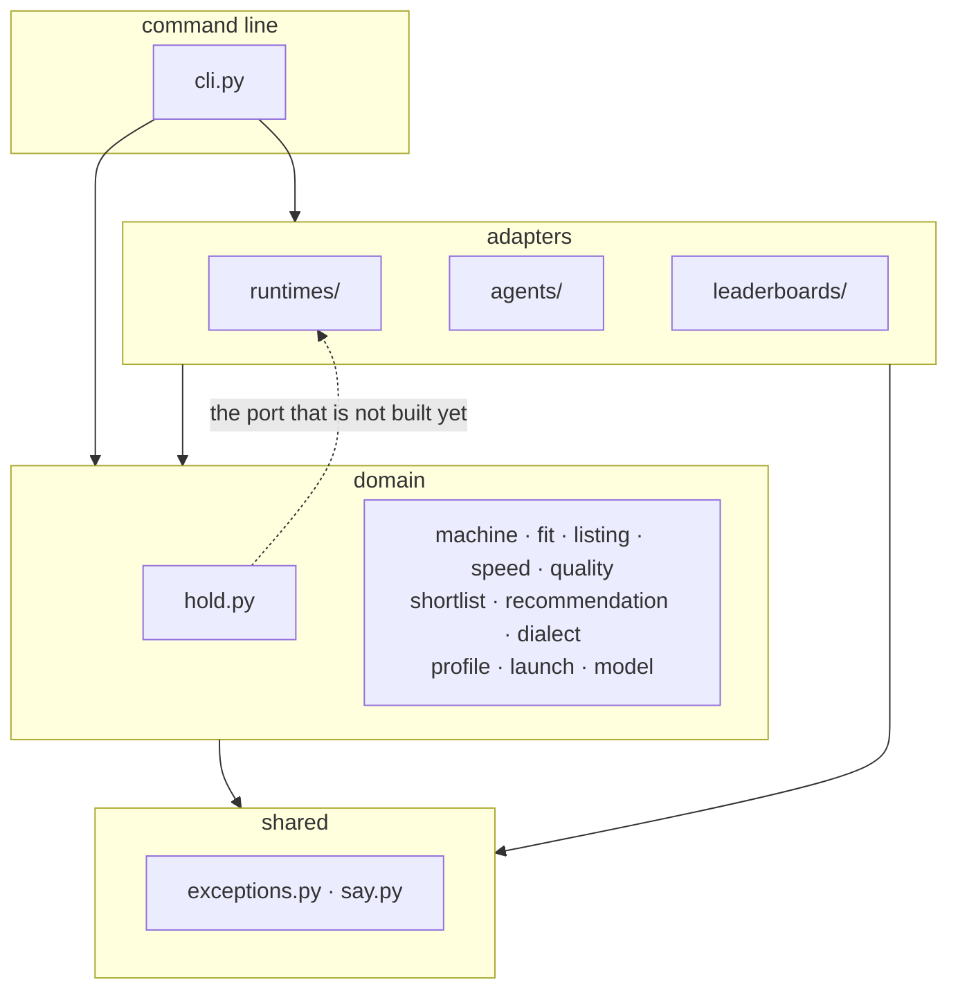
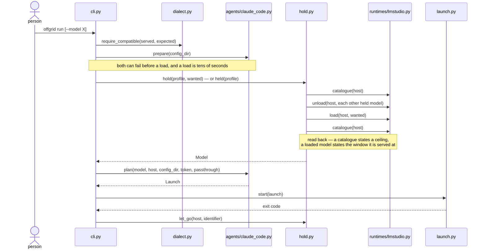
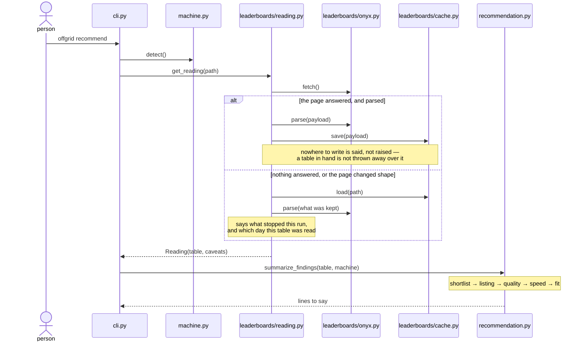

# Architecture

Where a change goes, what may import what, and where a second runtime or a
second agent attaches. The words used here are defined in `CONTEXT.md`, and
what was decided and why is in `docs/decisions.md`.

Written against `v0.1.0`, which connects LM Studio to Claude Code and
recommends from one published list.

## The layers



Dependencies point inwards: adapters know about the domain, the domain knows
nothing about adapters. The command line is outermost and may reach anything;
`shared` is innermost and reaches nothing of offgrid's.

The dotted edge is the exception, and it is the subject of the last section.

### What checks this

`import-linter` states the rule as two contracts in `pyproject.toml`, and the
hooks run them on every commit, so a broken layer fails rather than waiting to
be spotted in review. `uv run lint-imports` runs them by hand.

The first contract is the rule above. The second is that no adapter reaches
for another: `runtimes/`, `agents/` and `leaderboards/` do not know each other
exists.

The first carries one exemption — `offgrid.hold -> offgrid.runtimes.lmstudio`,
the dotted edge — which the commit that builds the port deletes. So the check
is also the answer to whether that work is finished.

## The modules

**command line**

```
cli.py             setup, doctor, recommend, run
```

**adapters**

```
runtimes/          one module per runtime
  lmstudio.py      the catalogue, what is held, loading and letting go
agents/            one module per agent
  claude_code.py   the environment and arguments that point it at the runtime
leaderboards/      one module per published list
  onyx.py          fetching and parsing the page
  cache.py         keeping the last payload that parsed
  reading.py       which table to answer from, and what to say about it
```

**domain**

```
machine.py         what this Mac is, and how to give its GPU more room
fit.py             how much room it has
model.py           a model the runtime describes
listing.py         a model a published list describes, and which ones fit
speed.py           how fast this machine reads a model's weights
quality.py         how good a fit is, as one number and one word
shortlist.py       what fits, ranked, and what each rule dropped
recommendation.py  how that reads to whoever asked
dialect.py         which API shapes can be paired
profile.py         what is remembered between runs
launch.py          an environment and an argument list, and running one
hold.py            holding the model that answers, and letting it go
```

**shared**

```
exceptions.py      the errors offgrid raises on purpose
say.py             how offgrid talks to whoever ran it
```

Files stay under 150 lines and are organised by domain rather than by kind, so
a module that outgrows the limit is usually two ideas rather than one long one.

## What happens on `offgrid run`



The order is the design here, not an accident of how the code was written.

The dialect check and the agent's settings check both run *before* the load,
because both are knowable in advance and a load is tens of seconds nobody gets
back. From the moment a model is held, letting go is owed whatever happens —
so the launch sits in a `try`, `let_go` sits in the `finally`, and a failed
load lets go of the weights the runtime may have taken anyway.

The model is read back from the catalogue after loading rather than trusted
from before it. A catalogue entry states a model's ceiling; a loaded one
states the window it is actually served at. Sizing an agent's context from the
ceiling means the agent never compacts and the runtime truncates the prefix
instead, which is the failure compacting exists to avoid.

Every model but the one being asked for is let go first: one machine, one pool
of memory, and what is held is memory the rest of the machine cannot use.

## What happens on `offgrid recommend`



A published list is somebody else's site, and the machine reading it may have
no network at all. So a stale table answers when a current one cannot, and how
old it is is said every time it is used. A payload is kept only once it has
parsed — keeping one that did not would take the fall back away at the moment
it is all the command has left.

`setup` and `doctor` are linear and need no diagram. `setup` measures the
machine, writes the profile and says what fits. `doctor` asks the runtime what
it is holding and prints it beside the agent's dialect.

## The seam a second adapter attaches at

`runtimes/` and `agents/` are folders, not seams. `cli.py` and `hold.py`
import LM Studio and Claude Code by name, and `profile.runtime` and
`profile.agent` are validated and then never dispatched on.

This section records what the current client consumes. It is a description of
today, not a contract a second adapter must satisfy — a port drawn from one
implementation fits that one implementation, and `docs/decisions.md` records
why it was deferred until there is a second to draw it from.

### What a runtime supplies today

| Called | Shape | By |
|---|---|---|
| `dialect()` | `-> Dialect` | `cli.py` |
| `catalogue(host)` | `-> dict` | `hold.py` |
| `parse_models(payload)` | `dict -> list[Model]` | `hold.py` |
| `loaded(payload)` | `dict -> list[Model]` | `hold.py` |
| `resident(payload)` | `dict -> Model \| None` | `hold.py` |
| `load(host, identifier, timeout)` | `-> None` | `hold.py` |
| `unload(host, identifier)` | `-> None` | `hold.py` |

### What an agent supplies today

| Called | Shape | By |
|---|---|---|
| `dialect()` | `-> Dialect` | `cli.py` |
| `prepare(config_dir)` | `-> None` | `cli.py` |
| `plan(model, host, config_dir, token, passthrough)` | `-> Launch` | `cli.py` |

### Two parts of this are LM Studio's, and may be nobody else's

**The payload crosses the boundary.** Four of the seven runtime functions take
or return LM Studio's `/api/v0/models` body as a `dict`. `hold.py` fetches it
once and asks it three questions, which is one HTTP call rather than three and
is deliberate. Whether another runtime answers all three from one response is
not known, and a port that keeps this shape asks every runtime to have a
catalogue endpoint shaped like this one.

**`unload` may be policy rather than an operation.** Issue #19 measured oMLX
managing its own memory and evicting least-recently-used, which makes letting
go of everything else offgrid doing a job the runtime is already doing, against
a runtime that will undo it. If a runtime cannot be commanded to release a
model, "hold one model" stops being something the port exposes and becomes
something the domain asks for and a runtime honours as it can.

A third finding of #19 is not a port question at all: oMLX raises the Metal
wired limit at startup and enforces its own ceiling, so `machine.py` reads a
number it treats as a property of the machine and which is, against that
runtime, a property of whatever started last.

### The same policy, in two places

`hold.py` decides which model answers and imports `runtimes/lmstudio.py` by
name. `leaderboards/reading.py` decides which table answers and imports
`leaderboards/onyx.py` by name. Same job, same coupling — but `reading.py`
lives inside the adapter package and `hold.py` lives outside it, so only one of
the two is visible as a layer violation.

Whether `reading.py` belongs where it is, or beside `hold.py` in the domain, is
open. Nothing forces it today, because there is one published list.

### Where a second adapter enters

`CONTEXT.md` names Ollama as a candidate runtime and OpenCode as a candidate
agent; issue #19 weighs oMLX and records what was measured on this machine.

Ollama serves the `openai` dialect. Both current adapters speak `anthropic`,
so `require_compatible` cannot fail today and the refusal it exists for has
never run against a real pair. A runtime serving a different dialect is what
makes that path reachable, and refusing the pair — rather than translating
between them — is the intended behaviour.

Issue #12 records what arrives with the second adapter: the ports, a
name-to-adapter registry, and `profile.runtime` and `profile.agent` finally
becoming load-bearing.
